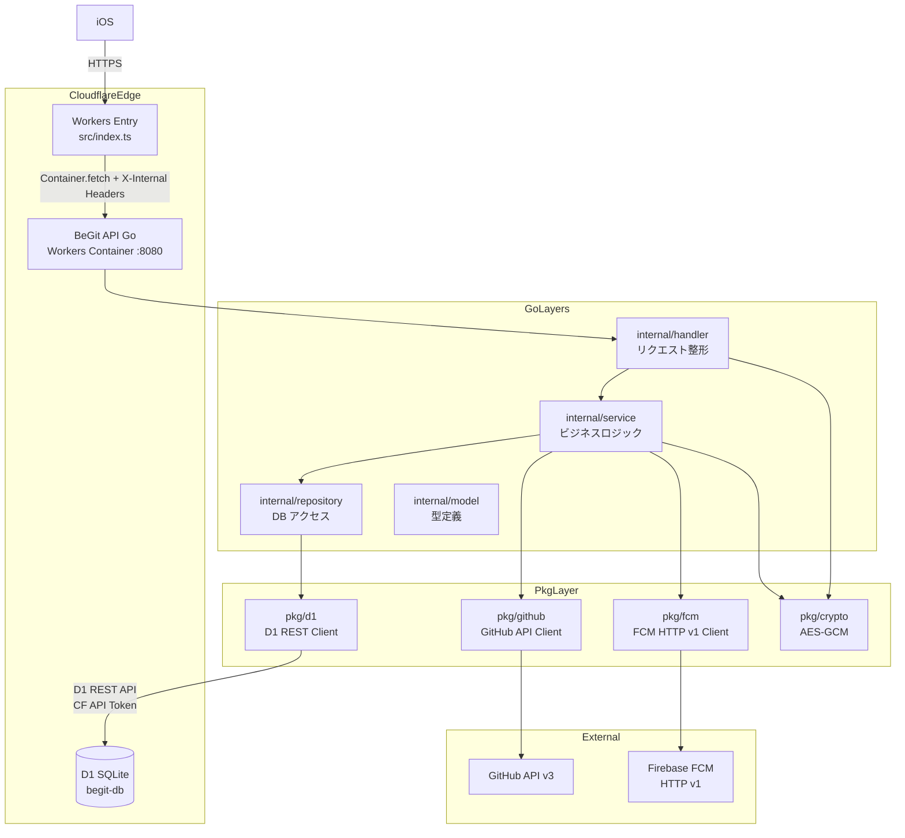
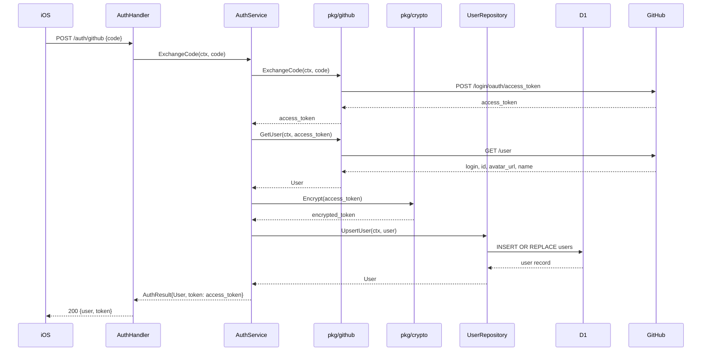
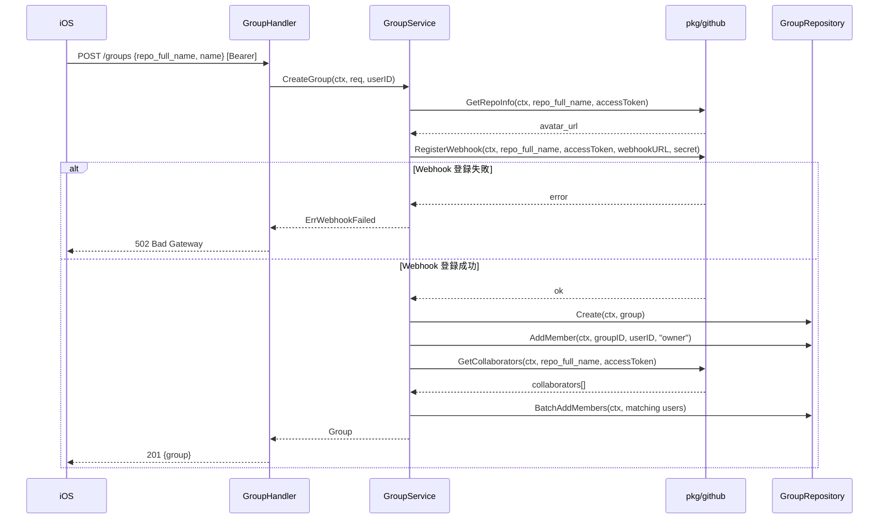
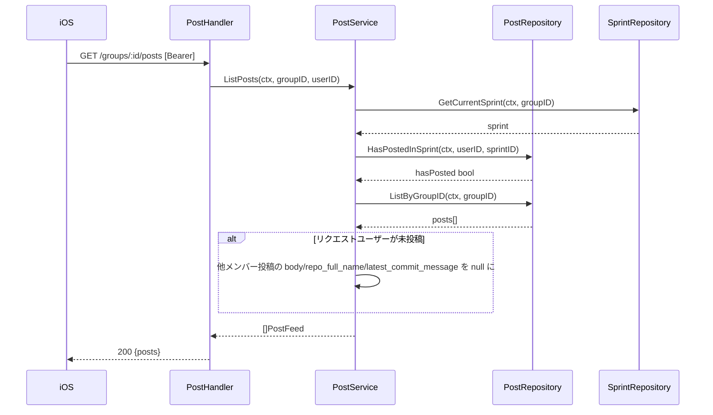

# 技術設計書: BeGit; バックエンド REST API

## Overview

BeGit; バックエンド REST API は、iOS クライアントのリクエストを受け付け GitHub OAuth 認証・グループ管理・BeGit Time 通知発行・投稿フィード・GitHub Webhook 受信・FCM トークン管理の6機能を提供する Go サーバーである。Cloudflare Workers Container（ポート 8080）として動作し、Cloudflare D1（SQLite 互換）をデータストアとして使用する。

本 API はハッカソンプロダクト「BeReal × GitHub」コンセプトのコアであり、iOS クライアントが必要とするすべてのバックエンドロジックを担う。Workers（TypeScript）はルーティングのエントリーポイントとして機能し、Go Container はすべてのビジネスロジックおよび外部 API 連携を担当する。

### Goals

- GitHub OAuth 2.0 フローによる認証基盤の構築（access_token の AES-GCM 暗号化保存）
- Clean Architecture 3層（handler → service → repository）による疎結合な実装
- D1 REST API 経由の型安全なデータアクセス
- FCM HTTP v1 API による確実な Push 通知送信
- HMAC-SHA256 署名検証と冪等性制御による安全な Webhook 受信

### Non-Goals

- R2 への画像アップロード処理
- Cloudflare Workers のルーティング設定（src/index.ts の routing 変更）
- iOS クライアント実装・Firebase SDK iOS 設定
- Cron による定期スプリント更新

---

## Boundary Commitments

### This Spec Owns

- `backend/cmd/server/` — HTTP サーバー起動・ルーティング・ミドルウェア登録
- `backend/internal/handler/` — 全エンドポイントのリクエスト/レスポンス整形（7ハンドラー）
- `backend/internal/service/` — ビジネスロジック（6サービス）
- `backend/internal/repository/` — D1 データアクセス（7リポジトリ）
- `backend/internal/model/` — ドメインモデル型定義
- `backend/pkg/d1/` — Cloudflare D1 REST API クライアント
- `backend/pkg/github/` — GitHub REST API v3 クライアント
- `backend/pkg/fcm/` — FCM HTTP v1 API クライアント
- `backend/pkg/crypto/` — AES-GCM 暗号化ユーティリティ
- `backend/migrations/0002_add_groups_fields.sql` — groups テーブルへの name/avatar_url 追加

### Out of Boundary

- `backend/src/index.ts` — ルーティングロジックの変更（シークレット注入の隣接変更は除く）
- Terraform / Wrangler IaC 設定変更
- GitHub OAuth App の作成・設定
- FCM プロジェクト・Firebase プロジェクトの設定
- D1 スキーマ `0001_initial.sql` の変更

### Allowed Dependencies

- `src/index.ts` が Workers Secrets を `X-Internal-*` ヘッダーとして Container に転送する隣接変更（このスペック外だが必須前提）
- Cloudflare Workers Secrets に以下が設定済みであること:
  `GITHUB_CLIENT_ID`, `GITHUB_CLIENT_SECRET`, `GITHUB_WEBHOOK_SECRET`, `FIREBASE_SERVICE_ACCOUNT_JSON`, `DB_ENCRYPTION_KEY`, `CF_API_TOKEN`
- wrangler.toml `[vars]` に以下が設定済みであること:
  `CF_ACCOUNT_ID`, `D1_DATABASE_ID`, `APP_BASE_URL`
- `0001_initial.sql` のスキーマが D1 に適用済みであること

### Revalidation Triggers

- D1 テーブル構造・カラム名の変更
- GitHub OAuth / GitHub API エンドポイントの変更
- FCM HTTP v1 API 認証方式の変更
- Workers → Container シークレット注入機構の変更

---

## Architecture

### Architecture Pattern & Boundary Map

Go サーバーは **Clean Architecture（Layered Architecture）** を採用する。依存方向は `handler → service → repository → pkg` の一方向のみを許可し、逆方向の依存を禁止する。



**Architecture Integration**:
- 選択パターン: Clean Architecture（Layered）— steering の「handler → service → repository 依存方向厳守」原則に完全準拠
- 新規コンポーネント: `pkg/d1`（D1 REST API ラッパー）— Workers Container から D1 へのアクセス唯一の手段として必要
- Steering 準拠: `cmd/`, `internal/`, `pkg/` のパッケージ構成を維持

### Technology Stack

| レイヤー | 選択 / バージョン | 役割 | 備考 |
|---------|----------------|------|------|
| Runtime | Go 1.22 (linux/amd64) | Workers Container プロセス | 既存 Dockerfile 維持 |
| HTTP | net/http + Go 1.22 ServeMux | ルーティング・ミドルウェア | 外部依存なし、`:id` パターン対応 |
| DB Client | Cloudflare D1 REST API | SQLite 互換 DB アクセス | `pkg/d1` で実装 |
| Crypto | crypto/aes, crypto/cipher (標準) | AES-GCM 暗号化 | 外部依存なし |
| GitHub | net/http（標準） | GitHub REST API v3 呼び出し | `pkg/github` で実装 |
| FCM | golang.org/x/oauth2/google | Service Account JWT 生成 + FCM 送信 | `go.mod` に追加 |
| JSON | encoding/json（標準） | リクエスト/レスポンス シリアライズ | 外部依存なし |

---

## File Structure Plan

### Directory Structure

```
backend/
├── cmd/
│   └── server/
│       └── main.go               # HTTP サーバー起動・ルーティング・DI
├── internal/
│   ├── handler/
│   │   ├── auth.go               # POST /auth/github
│   │   ├── groups.go             # GET /groups, POST /groups, GET /groups/:id
│   │   ├── notifications.go      # POST /groups/:id/notifications, GET /groups/:id/notifications/:nid
│   │   ├── posts.go              # POST /groups/:id/posts, GET /groups/:id/posts
│   │   ├── webhook.go            # POST /webhook/github
│   │   ├── fcm_token.go          # PUT /me/fcm-token
│   │   └── middleware.go         # BearerAuth, GroupMember ミドルウェア
│   ├── service/
│   │   ├── auth_service.go       # GitHub OAuth フロー
│   │   ├── group_service.go      # グループ CRUD + Webhook 登録 + メンバー自動追加
│   │   ├── notification_service.go # BeGit Time 発行 + FCM 送信 + ステータス算出
│   │   ├── post_service.go       # 投稿作成（GitHub コミット取得）+ フィード（ぼかし制御）
│   │   ├── webhook_service.go    # push/pull_request_review イベント処理
│   │   └── fcm_token_service.go  # FCM トークン UPSERT
│   ├── repository/
│   │   ├── user_repository.go    # users テーブル
│   │   ├── group_repository.go   # groups + group_members テーブル
│   │   ├── sprint_repository.go  # sprints テーブル（GetOrCreate）
│   │   ├── notification_repository.go # notifications テーブル
│   │   ├── post_repository.go    # posts テーブル
│   │   ├── webhook_repository.go # github_webhook_deliveries テーブル
│   │   └── fcm_token_repository.go # fcm_tokens テーブル
│   └── model/
│       └── models.go             # 全ドメインモデル型定義
├── pkg/
│   ├── d1/
│   │   └── client.go             # D1 REST API クライアント
│   ├── github/
│   │   └── client.go             # GitHub API クライアント
│   ├── fcm/
│   │   └── client.go             # FCM HTTP v1 クライアント
│   └── crypto/
│       └── aes.go                # 導出ノンス AES-GCM 暗号化
├── migrations/
│   ├── 0001_initial.sql          # 既存（変更なし）
│   └── 0002_add_groups_fields.sql # 新規: groups.name / groups.avatar_url 追加
├── cmd/server/main.go            # 上記 cmd/server/ と同一
├── go.mod                        # golang.org/x/oauth2 依存を追加
├── Dockerfile                    # 既存（変更なし）
└── wrangler.toml                 # [vars] CF_ACCOUNT_ID, D1_DATABASE_ID, APP_BASE_URL 追加（隣接変更）
```

---

## System Flows

### Flow 1: GitHub OAuth 認証



認証フロー上の決定事項: Bearer トークンは GitHub の access_token そのもの。Middleware での検索は `Encrypt(bearer)` → `encrypted_access_token` の DB 照合で行う（導出ノンス方式）。

### Flow 2: グループ作成（Webhook 先行登録）



Webhook URL: `{APP_BASE_URL}/webhook/github`。D1 INSERT 後の Webhook 失敗（孤立 Webhook）はハッカソンスコープでは許容する既知の制限。

### Flow 3: 投稿フィード（ぼかし制御）



---

## Requirements Traceability

| 要件 | 概要 | コンポーネント | インターフェース | フロー |
|------|------|--------------|----------------|-------|
| 1.1 | GitHub code 交換 | AuthHandler, AuthService, pkg/github | ExchangeCode | OAuth Flow |
| 1.2 | GitHub ユーザー情報取得 | AuthService, pkg/github | GetUser | OAuth Flow |
| 1.3 | 新規ユーザー作成 | AuthService, UserRepository | UpsertUser | OAuth Flow |
| 1.4 | 既存ユーザーのトークン更新 | AuthService, UserRepository | UpsertUser | OAuth Flow |
| 1.5 | user+token レスポンス返却 | AuthHandler | AuthResponse | OAuth Flow |
| 1.6 | 401 無効コード | AuthHandler | ErrorResponse | - |
| 1.7 | Bearer 認証ミドルウェア | BearerAuthMiddleware | - | 全保護エンドポイント |
| 2.1 | グループ一覧取得 | GroupHandler, GroupService, GroupRepository | ListGroups | - |
| 2.2 | グループ作成 | GroupHandler, GroupService, GroupRepository | CreateGroup | Group Flow |
| 2.3 | GitHub Webhook 登録 | GroupService, pkg/github | RegisterWebhook | Group Flow |
| 2.4 | コラボレーター自動追加 | GroupService, pkg/github, GroupRepository | GetCollaborators | Group Flow |
| 2.5 | グループ詳細+メンバー | GroupHandler, GroupService, GroupRepository | GetGroup | - |
| 2.6 | 403 非メンバーアクセス | GroupMemberMiddleware | - | - |
| 2.7 | 404 グループ不在 | GroupRepository | - | - |
| 2.8 | Webhook 失敗時ロールバック | GroupService | CreateGroup | Group Flow |
| 3.1 | 通知発行+スプリント管理 | NotificationHandler, NotificationService, SprintRepository | SendNotification | Notification Flow |
| 3.2 | FCM Push 送信 | NotificationService, pkg/fcm | SendToTokens | Notification Flow |
| 3.3 | 1 スプリント 1 通知制約 | NotificationRepository (UNIQUE) | Create | - |
| 3.4 | 通知ステータス取得 | NotificationHandler, NotificationService | GetNotificationStatus | - |
| 3.5 | On Time 判定 | NotificationService | GetNotificationStatus | - |
| 3.6 | Late 判定 | NotificationService | GetNotificationStatus | - |
| 3.7 | Missed 判定 | NotificationService | GetNotificationStatus | - |
| 3.8 | 404 通知不在 | NotificationRepository | GetByID | - |
| 4.1 | GitHub コミット自動取得 | PostService, pkg/github | GetRecentCommits | Post Flow |
| 4.2 | 投稿レコード INSERT | PostService, PostRepository | Create | Post Flow |
| 4.3 | フィード一覧取得 | PostHandler, PostService, PostRepository | ListPosts | Feed Flow |
| 4.4 | ぼかし制御（未投稿） | PostService | ListPosts | Feed Flow |
| 4.5 | 全公開（投稿済み） | PostService | ListPosts | Feed Flow |
| 4.6 | 502 GitHub API 失敗 | PostService | - | - |
| 4.7 | 403 非メンバー投稿 | GroupMemberMiddleware | - | - |
| 5.1 | HMAC 署名検証 | WebhookHandler | VerifySignature | Webhook Flow |
| 5.2 | 403 署名不正 | WebhookHandler | - | - |
| 5.3 | 冪等性制御 | WebhookHandler, WebhookRepository | InsertDelivery | Webhook Flow |
| 5.4 | push イベント処理 | WebhookService | ProcessWebhook | Webhook Flow |
| 5.5 | pull_request_review 処理 | WebhookService | ProcessWebhook | Webhook Flow |
| 5.6 | Webhook に Bearer 不要 | WebhookHandler（middleware 除外） | - | - |
| 5.7 | グループ不在時 200 無視 | WebhookService | ProcessWebhook | - |
| 6.1 | FCM トークン UPSERT | FCMTokenHandler, FCMTokenService, FCMTokenRepository | Upsert | - |
| 6.2 | 重複トークン更新 | FCMTokenRepository (INSERT OR REPLACE) | Upsert | - |
| 6.3 | 200 成功 | FCMTokenHandler | - | - |
| 6.4 | 400 トークン欠損 | FCMTokenHandler | - | - |
| 7.1 | AES-GCM 暗号化 | pkg/crypto | Encryptor | 全認証フロー |
| 7.2 | シークレット env 管理 | cmd/server/main.go Config | - | - |
| 7.3 | JSON レスポンス | 全 Handler | - | - |
| 7.4 | 500 内部エラー | 全 Handler | ErrorResponse | - |
| 7.5 | 422 バリデーションエラー | 全 Handler | ErrorResponse | - |
| 7.6 | 依存方向厳守 | アーキテクチャ全体 | - | - |
| 7.7 | パッケージ構成 | ディレクトリ設計 | - | - |

---

## Components and Interfaces

### コンポーネント サマリー

| コンポーネント | レイヤー | 責務 | 要件カバレッジ | 主要依存 |
|-------------|---------|------|-------------|---------|
| BearerAuthMiddleware | Middleware | Bearer トークン検証・userID 注入 | 1.7 | UserRepository (P0), pkg/crypto (P0) |
| GroupMemberMiddleware | Middleware | グループメンバーシップ検証 | 2.6, 4.7 | GroupRepository (P0) |
| AuthHandler | Handler | POST /auth/github | 1.1–1.6 | AuthService (P0) |
| GroupHandler | Handler | GET/POST /groups, GET /groups/:id | 2.1–2.8 | GroupService (P0) |
| NotificationHandler | Handler | POST/GET /groups/:id/notifications/:nid | 3.1–3.8 | NotificationService (P0) |
| PostHandler | Handler | POST/GET /groups/:id/posts | 4.1–4.7 | PostService (P0) |
| WebhookHandler | Handler | POST /webhook/github | 5.1–5.7 | WebhookService (P0) |
| FCMTokenHandler | Handler | PUT /me/fcm-token | 6.1–6.4 | FCMTokenService (P0) |
| AuthService | Service | GitHub OAuth フロー | 1.1–1.5 | UserRepository (P0), pkg/github (P0), pkg/crypto (P0) |
| GroupService | Service | グループ管理 + Webhook 登録 | 2.1–2.8 | GroupRepository (P0), pkg/github (P0) |
| NotificationService | Service | BeGit Time 発行 + ステータス算出 | 3.1–3.8 | NotificationRepository (P0), SprintRepository (P0), FCMTokenRepository (P0), pkg/fcm (P0) |
| PostService | Service | 投稿作成 + フィード（ぼかし） | 4.1–4.7 | PostRepository (P0), SprintRepository (P0), pkg/github (P0) |
| WebhookService | Service | push/PR review イベント処理 | 5.4, 5.5, 5.7 | GroupRepository (P1), SprintRepository (P1) |
| FCMTokenService | Service | FCM トークン管理 | 6.1–6.4 | FCMTokenRepository (P0) |
| UserRepository | Repository | users テーブル CRUD | 1.3, 1.4, 1.7 | pkg/d1 (P0) |
| GroupRepository | Repository | groups / group_members テーブル | 2.1–2.5 | pkg/d1 (P0) |
| SprintRepository | Repository | sprints テーブル GetOrCreate | 3.1, 4.4 | pkg/d1 (P0) |
| NotificationRepository | Repository | notifications テーブル | 3.1, 3.3, 3.8 | pkg/d1 (P0) |
| PostRepository | Repository | posts テーブル | 4.2–4.5 | pkg/d1 (P0) |
| WebhookRepository | Repository | github_webhook_deliveries テーブル | 5.3 | pkg/d1 (P0) |
| FCMTokenRepository | Repository | fcm_tokens テーブル | 6.1, 6.2 | pkg/d1 (P0) |
| pkg/d1 | Pkg | Cloudflare D1 REST API クライアント | 全 Repository | Cloudflare API (P0) |
| pkg/github | Pkg | GitHub REST API v3 クライアント | 1.1–1.2, 2.3–2.4, 4.1 | GitHub API (P0) |
| pkg/fcm | Pkg | FCM HTTP v1 クライアント | 3.2 | FCM API (P0) |
| pkg/crypto | Pkg | AES-GCM 暗号化（導出ノンス） | 7.1, 1.3, 1.7 | crypto/aes (標準) (P0) |

---

### Middleware Layer

#### BearerAuthMiddleware

| フィールド | 詳細 |
|---------|------|
| Intent | Authorization ヘッダーを検証してリクエストコンテキストに userID を注入する |
| Requirements | 1.7 |

**Responsibilities & Constraints**
- `Authorization: Bearer <token>` を抽出
- `pkg/crypto.Encrypt(token)` → `encrypted_access_token` でユーザー検索
- 見つかった userID を `context.WithValue` でコンテキストに注入
- `/auth/github` および `/webhook/github` は除外

**Contracts**: Service [x] / API [ ] / Event [ ] / Batch [ ] / State [ ]

```go
// middleware.go
type contextKey string
const UserIDKey contextKey = "userID"

func BearerAuthMiddleware(
    userRepo repository.UserRepository,
    crypto   crypto.Encryptor,
) func(http.Handler) http.Handler
```

**Implementation Notes**
- Validation: `Authorization` ヘッダーが `Bearer ` プレフィックスを持つか確認
- Risks: 導出ノンス AES-GCM の決定性に依存。暗号化ライブラリを変更した場合は再認証が必要

---

### Handler Layer (`internal/handler/`)

#### AuthHandler

| フィールド | 詳細 |
|---------|------|
| Intent | GitHub OAuth code を受け取り access_token + ユーザー情報を返す |
| Requirements | 1.1, 1.2, 1.3, 1.4, 1.5, 1.6 |

**Contracts**: Service [x] / API [x]

##### API Contract

| Method | Endpoint | Request Body | Response | Errors |
|--------|----------|-------------|----------|--------|
| POST | /auth/github | `{"code": string}` | `{"user": User, "token": string}` | 401, 500 |

```go
type AuthResponse struct {
    User  UserJSON `json:"user"`
    Token string   `json:"token"`
}
type UserJSON struct {
    ID        int64  `json:"id"`
    Login     string `json:"login"`
    AvatarURL string `json:"avatar_url"`
    Name      string `json:"name"`
}
```

---

#### GroupHandler

| フィールド | 詳細 |
|---------|------|
| Intent | グループ一覧・作成・詳細の HTTP インターフェース |
| Requirements | 2.1, 2.2, 2.5, 2.6, 2.7, 2.8 |

**Contracts**: Service [x] / API [x]

##### API Contract

| Method | Endpoint | Request Body | Response | Errors |
|--------|----------|-------------|----------|--------|
| GET | /groups | - | `{"groups": []GroupJSON}` | 401, 500 |
| POST | /groups | `{"repo_full_name": string, "name": string}` | `GroupJSON` | 401, 422, 502, 500 |
| GET | /groups/:id | - | `GroupDetailJSON` | 401, 403, 404, 500 |

```go
type GroupJSON struct {
    ID           int64  `json:"id"`
    Name         string `json:"name"`
    RepoFullName string `json:"repo_full_name"`
    AvatarURL    string `json:"avatar_url"`
}
type GroupDetailJSON struct {
    GroupJSON
    Members []GroupMemberJSON `json:"members"`
}
type GroupMemberJSON struct {
    UserID    int64  `json:"user_id"`
    Login     string `json:"login"`
    AvatarURL string `json:"avatar_url"`
    Role      string `json:"role"`
}
```

---

#### NotificationHandler

| フィールド | 詳細 |
|---------|------|
| Intent | BeGit Time 通知の発行と投稿ステータス照会 |
| Requirements | 3.1–3.8 |

**Contracts**: Service [x] / API [x]

##### API Contract

| Method | Endpoint | Request Body | Response | Errors |
|--------|----------|-------------|----------|--------|
| POST | /groups/:id/notifications | - | `NotificationJSON` | 401, 403, 409, 500 |
| GET | /groups/:id/notifications/:nid | - | `NotificationStatusJSON` | 401, 403, 404, 500 |

```go
type NotificationJSON struct {
    ID       int64  `json:"id"`
    SprintID int64  `json:"sprint_id"`
    SentAt   string `json:"sent_at"`
}
type NotificationStatusJSON struct {
    NotificationID int64              `json:"notification_id"`
    Members        []MemberStatusJSON `json:"members"`
}
type MemberStatusJSON struct {
    UserID    int64  `json:"user_id"`
    Login     string `json:"login"`
    AvatarURL string `json:"avatar_url"`
    Status    string `json:"status"` // "On Time" | "Late" | "Missed"
}
```

---

#### PostHandler

| フィールド | 詳細 |
|---------|------|
| Intent | 投稿作成とフィード取得（ぼかし制御付き） |
| Requirements | 4.1–4.7 |

**Contracts**: Service [x] / API [x]

##### API Contract

| Method | Endpoint | Request Body | Response | Errors |
|--------|----------|-------------|----------|--------|
| POST | /groups/:id/posts | `{"body": string?, "notification_id": int?}` | `PostJSON` | 401, 403, 502, 500 |
| GET | /groups/:id/posts | - | `{"posts": []PostFeedJSON}` | 401, 403, 500 |

```go
type PostJSON struct {
    ID                  int64   `json:"id"`
    UserID              int64   `json:"user_id"`
    PostType            string  `json:"post_type"`
    Body                *string `json:"body"`
    RepoFullName        *string `json:"repo_full_name"`
    CommitCount         int     `json:"commit_count"`
    Additions           int     `json:"additions"`
    Deletions           int     `json:"deletions"`
    LatestCommitMessage *string `json:"latest_commit_message"`
    Status              *string `json:"status"`
    CreatedAt           string  `json:"created_at"`
}
type PostFeedJSON struct {
    PostJSON
    Login     string `json:"login"`
    AvatarURL string `json:"avatar_url"`
}
```

**Implementation Notes**
- ぼかし制御: リクエストユーザーが現スプリントで未投稿の場合、他メンバーの `body`, `repo_full_name`, `latest_commit_message` フィールドを `nil` にして返す
- Risks: ぼかし判定は現スプリントに基づく。スプリント切り替わりのタイミングで一時的な判定ずれが発生しうる

---

#### WebhookHandler

| フィールド | 詳細 |
|---------|------|
| Intent | GitHub Webhook イベントの HMAC 検証・冪等性制御・イベント処理委譲 |
| Requirements | 5.1–5.7 |

**Contracts**: Service [x] / API [x]

##### API Contract

| Method | Endpoint | Request | Response | Errors |
|--------|----------|---------|----------|--------|
| POST | /webhook/github | GitHub Webhook payload | 200 OK | 403 (署名不正) |

**Implementation Notes**
- BearerAuthMiddleware を除外（5.6）
- HMAC: `hmac.New(sha256.New, []byte(GITHUB_WEBHOOK_SECRET))` + `X-Hub-Signature-256` ヘッダー検証
- 冪等性: WebhookRepository.InsertDelivery が UNIQUE 違反を返したら即 200 を返す
- Risks: GITHUB_WEBHOOK_SECRET が未設定の場合、全 Webhook が 403 になる

---

#### FCMTokenHandler

| フィールド | 詳細 |
|---------|------|
| Intent | FCM デバイストークンの登録・更新 |
| Requirements | 6.1–6.4 |

**Contracts**: Service [x] / API [x]

##### API Contract

| Method | Endpoint | Request Body | Response | Errors |
|--------|----------|-------------|----------|--------|
| PUT | /me/fcm-token | `{"fcm_token": string}` | `200 OK {}` | 400, 401, 500 |

---

### Service Layer (`internal/service/`)

#### AuthService

**Contracts**: Service [x]

```go
type AuthService interface {
    ExchangeCode(ctx context.Context, code string) (*AuthResult, error)
}
type AuthResult struct {
    User  model.User
    Token string
}
```

- Preconditions: `code` は GitHub が発行した有効な認可コード
- Postconditions: `users` テーブルにレコードが UPSERT され、平文 access_token を返す
- Invariants: `encrypted_access_token` は常に AES-GCM 暗号化済み平文を保持

---

#### GroupService

**Contracts**: Service [x]

```go
type GroupService interface {
    ListGroups(ctx context.Context, userID int64) ([]model.Group, error)
    CreateGroup(ctx context.Context, req CreateGroupRequest, userID int64) (*model.Group, error)
    GetGroup(ctx context.Context, groupID, userID int64) (*model.GroupDetail, error)
}
type CreateGroupRequest struct {
    RepoFullName string
    Name         string
    AccessToken  string
}
type GroupDetail struct {
    model.Group
    Members []model.GroupMember
}
```

- Preconditions: CreateGroup は GitHub Webhook 登録が先行して成功していること
- Postconditions: CreateGroup 後、owner が group_members に挿入され、GitHub コラボレーターが BeGit users テーブルに存在すれば member として追加される

---

#### NotificationService

**Contracts**: Service [x]

```go
type NotificationService interface {
    SendNotification(ctx context.Context, groupID, userID int64) (*model.Notification, error)
    GetNotificationStatus(ctx context.Context, notifID, groupID int64) (*model.NotificationStatus, error)
}
type NotificationStatus struct {
    NotificationID int64
    Members        []MemberStatus
}
type MemberStatus struct {
    UserID    int64
    Login     string
    AvatarURL string
    Status    string // "On Time" | "Late" | "Missed"
}
```

- ステータス算出ロジック:
  - `post.created_at <= notification.sent_at + 1h` → `"On Time"`
  - `post.created_at > notification.sent_at + 1h` → `"Late"`
  - 投稿なし → `"Missed"`

---

#### PostService

**Contracts**: Service [x]

```go
type PostService interface {
    CreatePost(ctx context.Context, req CreatePostRequest, groupID, userID int64) (*model.Post, error)
    ListPosts(ctx context.Context, groupID, userID int64) ([]model.PostFeed, error)
}
type CreatePostRequest struct {
    Body           *string
    NotificationID *int64
    AccessToken    string
}
type PostFeed struct {
    model.Post
    Login     string
    AvatarURL string
    Blurred   bool
}
```

---

#### WebhookService

**Contracts**: Service [x]

```go
type WebhookService interface {
    ProcessWebhook(ctx context.Context, req WebhookRequest) error
}
type WebhookRequest struct {
    DeliveryID string
    EventType  string
    Payload    []byte
}
```

---

#### FCMTokenService

**Contracts**: Service [x]

```go
type FCMTokenService interface {
    UpsertFCMToken(ctx context.Context, userID int64, token string) error
}
```

---

### Repository Layer (`internal/repository/`)

#### UserRepository

```go
type UserRepository interface {
    GetByEncryptedToken(ctx context.Context, encryptedToken string) (*model.User, error)
    UpsertUser(ctx context.Context, user *model.User) (*model.User, error)
    GetByGitHubLogin(ctx context.Context, login string) (*model.User, error)
}
```

#### GroupRepository

```go
type GroupRepository interface {
    ListByUserID(ctx context.Context, userID int64) ([]model.Group, error)
    Create(ctx context.Context, group *model.Group) (*model.Group, error)
    GetByID(ctx context.Context, groupID int64) (*model.Group, error)
    GetByRepoFullName(ctx context.Context, repoFullName string) (*model.Group, error)
    AddMember(ctx context.Context, groupID, userID int64, role string) error
    BatchAddMembers(ctx context.Context, groupID int64, userIDs []int64, role string) error
    IsMember(ctx context.Context, groupID, userID int64) (bool, error)
    GetMembers(ctx context.Context, groupID int64) ([]model.GroupMember, error)
}
```

#### SprintRepository

```go
type SprintRepository interface {
    GetOrCreateCurrentSprint(ctx context.Context, groupID int64, durationDays int) (*model.Sprint, error)
    GetCurrentSprint(ctx context.Context, groupID int64) (*model.Sprint, error)
}
```

GetOrCreate は `started_at <= now AND ends_at > now` のスプリントを検索し、存在しなければ新規作成する。

#### NotificationRepository

```go
type NotificationRepository interface {
    Create(ctx context.Context, notif *model.Notification) (*model.Notification, error)
    GetByID(ctx context.Context, notifID int64) (*model.Notification, error)
}
```

#### PostRepository

```go
type PostRepository interface {
    Create(ctx context.Context, post *model.Post) (*model.Post, error)
    ListByGroupID(ctx context.Context, groupID int64) ([]model.Post, error)
    HasPostedInSprint(ctx context.Context, userID, sprintID int64) (bool, error)
    GetByUserAndNotification(ctx context.Context, userID, notifID int64) (*model.Post, error)
}
```

#### WebhookRepository

```go
type WebhookRepository interface {
    InsertDelivery(ctx context.Context, deliveryID, eventType string) (isDuplicate bool, err error)
}
```

UNIQUE 制約違反の場合 `isDuplicate = true` を返す。エラーは発生させない。

#### FCMTokenRepository

```go
type FCMTokenRepository interface {
    Upsert(ctx context.Context, userID int64, token string) error
    GetTokensByGroupID(ctx context.Context, groupID int64) ([]string, error)
}
```

---

### External Package Layer (`pkg/`)

#### pkg/d1 — D1 REST API クライアント

| フィールド | 詳細 |
|---------|------|
| Intent | Cloudflare D1 REST API への SQL クエリ実行 |
| Requirements | 全 Repository |

**External**: `https://api.cloudflare.com/client/v4/accounts/{account_id}/d1/database/{database_id}/query` — D1 REST API (P0)

```go
type Client interface {
    Query(ctx context.Context, sql string, params ...interface{}) ([]map[string]interface{}, error)
    Exec(ctx context.Context, sql string, params ...interface{}) (rowsAffected int64, err error)
}
```

- エラー種別: `ErrNotFound`（結果0行）, `ErrConstraintViolation`（UNIQUE 違反）, `ErrD1API`（HTTP エラー）
- 実装: `params` は JSON 配列として D1 REST API に渡す

**Implementation Notes**
- `map[string]interface{}` をドメインモデルに変換するスキャン関数は各 Repository に実装
- Risks: D1 REST API の RTT（50-100ms）が蓄積するため、N+1 クエリを避けて JOIN / サブクエリで1リクエストに集約する

---

#### pkg/github — GitHub API クライアント

| フィールド | 詳細 |
|---------|------|
| Intent | GitHub REST API v3 の各エンドポイント呼び出しをラップ |
| Requirements | 1.1, 1.2, 2.3, 2.4, 4.1 |

**External**: `https://github.com/login/oauth/access_token` と `https://api.github.com` — GitHub API (P0)

```go
type Client interface {
    ExchangeCode(ctx context.Context, clientID, clientSecret, code string) (accessToken string, err error)
    GetUser(ctx context.Context, accessToken string) (*User, error)
    GetRepoInfo(ctx context.Context, repoFullName, accessToken string) (*RepoInfo, error)
    GetCollaborators(ctx context.Context, repoFullName, accessToken string) ([]User, error)
    RegisterWebhook(ctx context.Context, repoFullName, accessToken, webhookURL, secret string) error
    GetRecentCommits(ctx context.Context, repoFullName, login, accessToken string) (*CommitSummary, error)
}

type User struct {
    ID        int64  `json:"id"`
    Login     string `json:"login"`
    AvatarURL string `json:"avatar_url"`
    Name      string `json:"name"`
}
type RepoInfo struct {
    FullName  string `json:"full_name"`
    AvatarURL string // owner.avatar_url
}
type CommitSummary struct {
    CommitCount         int
    Additions           int
    Deletions           int
    LatestCommitMessage string
    RepoFullName        string
}
```

GetRecentCommits の実装: `GET /repos/{owner}/{repo}/commits?author={login}&per_page=5` → 最新コミットの SHA で `GET /repos/{owner}/{repo}/commits/{sha}` を呼び additions/deletions を取得（2 API calls）

---

#### pkg/fcm — FCM HTTP v1 クライアント

| フィールド | 詳細 |
|---------|------|
| Intent | Firebase Service Account 認証で FCM HTTP v1 API に Push 通知を送信 |
| Requirements | 3.2 |

**External**: `https://fcm.googleapis.com/v1/projects/{project_id}/messages:send` — FCM API (P0)

```go
type Client interface {
    SendToTokens(ctx context.Context, tokens []string, notification Notification) error
}
type Notification struct {
    Title string
    Body  string
}
```

- Service Account JSON から `golang.org/x/oauth2/google.JWTConfigFromJSON` でトークン取得
- project_id は `FIREBASE_SERVICE_ACCOUNT_JSON` 内の `project_id` フィールドから取得
- 複数トークンへの送信は 1 トークンずつ POST（FCM v1 はバルク送信不可）

---

#### pkg/crypto — AES-GCM 暗号化

| フィールド | 詳細 |
|---------|------|
| Intent | 導出ノンス AES-GCM による決定的暗号化（Bearer トークン検索に使用） |
| Requirements | 7.1, 1.3, 1.7 |

```go
type Encryptor interface {
    Encrypt(plaintext string) (string, error)  // 決定的: 同一入力 → 同一出力
    Decrypt(ciphertext string) (string, error)
}
```

- 実装: `nonce = SHA-256(encryptionKey || plaintext)[:12]`, AES-256-GCM
- 出力フォーマット: `hex(nonce) + ":" + hex(ciphertext)`
- `DB_ENCRYPTION_KEY` は 32 バイト（AES-256 用）の hex または base64 文字列として解釈

---

### model Types (`internal/model/models.go`)

```go
type User struct {
    ID                   int64
    GitHubID             int64
    GitHubLogin          string
    GitHubName           string
    AvatarURL            string
    EncryptedAccessToken string
    CreatedAt            time.Time
}

type Group struct {
    ID                 int64
    RepoFullName       string
    Name               string
    AvatarURL          string
    OwnerUserID        int64
    SprintDurationDays int
    CreatedAt          time.Time
}

type GroupMember struct {
    GroupID   int64
    UserID    int64
    Login     string
    AvatarURL string
    Role      string
    AutoJoined bool
}

type Sprint struct {
    ID        int64
    GroupID   int64
    IndexNum  int
    StartedAt time.Time
    EndsAt    time.Time
}

type Notification struct {
    ID       int64
    SprintID int64
    SentBy   int64
    Message  string
    SentAt   time.Time
}

type Post struct {
    ID                  int64
    NotificationID      *int64
    UserID              int64
    GroupID             int64
    PostType            string
    Body                *string
    RepoFullName        *string
    BranchName          *string
    CommitCount         int
    Additions           int
    Deletions           int
    LatestCommitMessage *string
    Status              *string
    CreatedAt           time.Time
}

type PostFeed struct {
    Post
    Login     string
    AvatarURL string
    Blurred   bool
}
```

---

## Data Models

### Physical Data Model（スキーマ変更）

既存の `0001_initial.sql` は変更しない。以下のマイグレーションを追加する。

**`migrations/0002_add_groups_fields.sql`**:

```sql
ALTER TABLE groups ADD COLUMN name TEXT NOT NULL DEFAULT '';
ALTER TABLE groups ADD COLUMN avatar_url TEXT;
```

背景: Req 2.1/2.2 でグループの `name`（ユーザー指定）と `avatar_url`（GitHub リポジトリオーナーのアバター）が必要だが `0001_initial.sql` に存在しない。

### Domain Model 要約

- **User**: GitHub アカウントの 1:1 マッピング。`encrypted_access_token` で GitHub API 呼び出し権限を保持
- **Group**: GitHub リポジトリに紐づくチーム単位。`owner_user_id` が作成者。`sprint_duration_days` でスプリント長を管理
- **GroupMember**: Group と User の多対多。`role: owner | member`
- **Sprint**: グループのアクティブな期間。`GetOrCreate` で「今日のスプリント」を取得/生成
- **Notification**: BeGit Time 通知。1スプリント1ユーザー1回制約（UNIQUE(sprint_id, sent_by)）
- **Post**: 投稿。`notification_id` でどの通知に応答したかを記録。`status: on_time | late | missed`

### Data Contracts（API レスポンス形式）

- 全レスポンス: `Content-Type: application/json`
- エラーレスポンス: `{ "error": "<message>" }`（スタックトレース非含有）
- バリデーションエラー: `{ "error": "<field>: <reason>" }`
- 日時フォーマット: RFC 3339（例: `"2026-05-31T12:00:00Z"`）

---

## Error Handling

### Error Strategy

- ハンドラーレベルで全エラーをキャッチし、適切な HTTP ステータスコードと JSON ボディを返す
- 内部エラー詳細（スタックトレース、SQL エラー）はクライアントに返さない（7.4）
- サービス層はドメインエラー型を返し、ハンドラーがステータスコードにマップする

### Error Categories and Responses

```go
// エラー型（service 層で使用）
var (
    ErrNotFound           = errors.New("not found")
    ErrForbidden          = errors.New("forbidden")
    ErrUnauthorized       = errors.New("unauthorized")
    ErrConflict           = errors.New("conflict")
    ErrValidation         = errors.New("validation error")
    ErrExternalAPI        = errors.New("external api error")
)
```

| エラー型 | HTTP Status | レスポンス例 |
|---------|------------|------------|
| ErrUnauthorized | 401 | `{"error": "unauthorized"}` |
| ErrForbidden | 403 | `{"error": "forbidden"}` |
| ErrNotFound | 404 | `{"error": "not found"}` |
| ErrConflict | 409 | `{"error": "conflict"}` |
| ErrValidation | 422 | `{"error": "fcm_token: required"}` |
| ErrExternalAPI | 502 | `{"error": "external api error"}` |
| その他 | 500 | `{"error": "internal server error"}` |

### Monitoring

- `log.Printf` による構造化ログ（エラー詳細をサーバーサイドに記録）
- エラー発生時は `error_code` と `endpoint` をログに含める

---

## Testing Strategy

### Unit Tests（`*_test.go`）

- `pkg/crypto`: AES-GCM の暗号化/復号の可逆性・決定性の検証
- `service/notification_service`: ステータス算出ロジック（On Time/Late/Missed の境界条件）
- `service/post_service`: ぼかし制御ロジック（HasPosted: true/false × 投稿者自身/他メンバー）
- `handler/middleware`: BearerAuth ミドルウェアの有効トークン・無効トークン・欠損ケース

### Integration Tests

- `handler/auth`: POST /auth/github → GitHub Mock → D1 Mock を通じたフルフロー
- `handler/webhook`: HMAC 検証 OK/NG → 冪等性制御（2回目の同じ delivery_id）
- `repository/group_repository`: D1 REST API レスポンスのモックを使った CRUD 検証
- `service/group_service`: Webhook 登録失敗時にグループが INSERT されないこと

---

## Security Considerations

- **トークン暗号化** (7.1): AES-256-GCM + 導出ノンス。`DB_ENCRYPTION_KEY` は 32 バイト。平文は DB に保存されない
- **Webhook 署名検証** (5.1): `hmac.Equal` による定数時間比較でタイミング攻撃を防ぐ
- **シークレット管理** (7.2): 全シークレットは `os.Getenv()` で起動時に読み込み。ソースコードにハードコードしない
- **内部ヘッダー保護**: Worker 側で `X-Internal-*` ヘッダーを外部リクエストから除去してから Container に転送する（src/index.ts の隣接変更で対処）
- **X-Hub-Signature-256 検証失敗** → 403 即時返却。ペイロード処理なし

## Performance & Scalability

- **D1 RTT**: D1 REST API は 1 呼び出しあたり約 50-100ms。N+1 を避けるため JOIN クエリでフィード取得を 2-3 クエリに抑える
- **Container Sleep**: `sleepAfter = "10m"`。デモ前に GET /groups 等でウォームアップ推奨
- **FCM 送信**: グループメンバー数 × 1 FCM API call。ハッカソン規模（〜20名）では問題なし
- **GitHub API Rate Limit**: 5000 req/hour/token。1投稿あたり 2 calls のため、1時間に 2500 投稿まで対応
