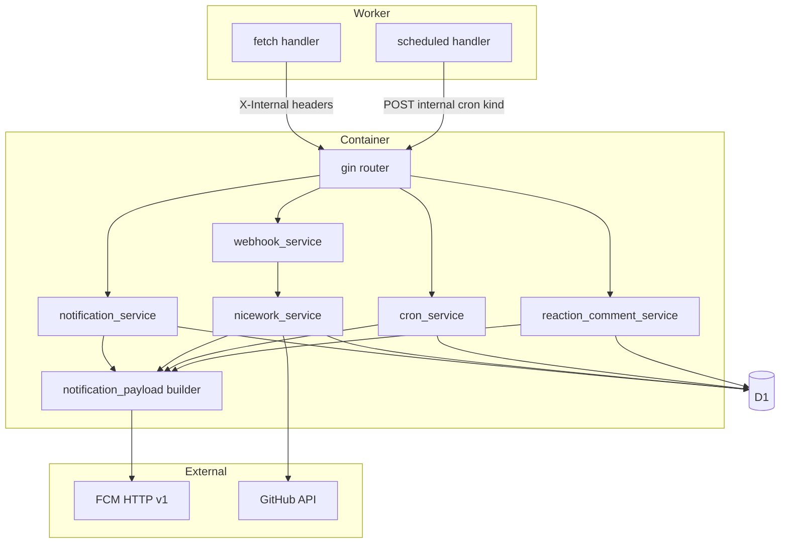
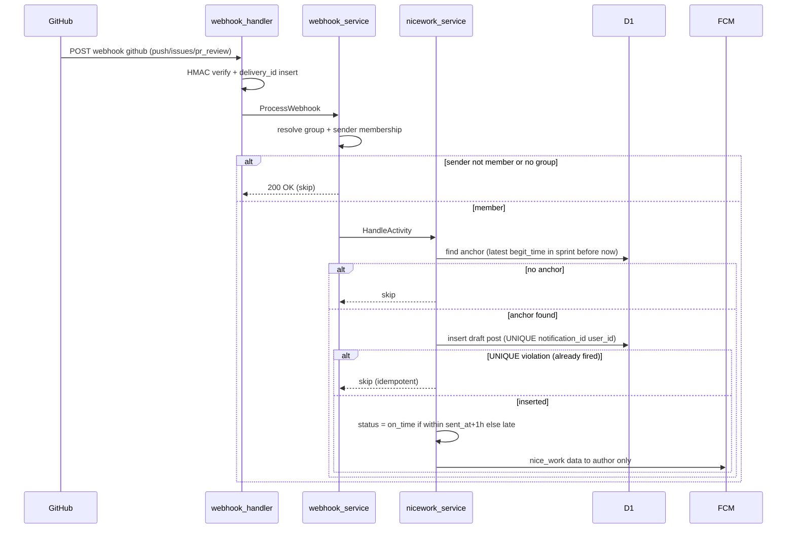
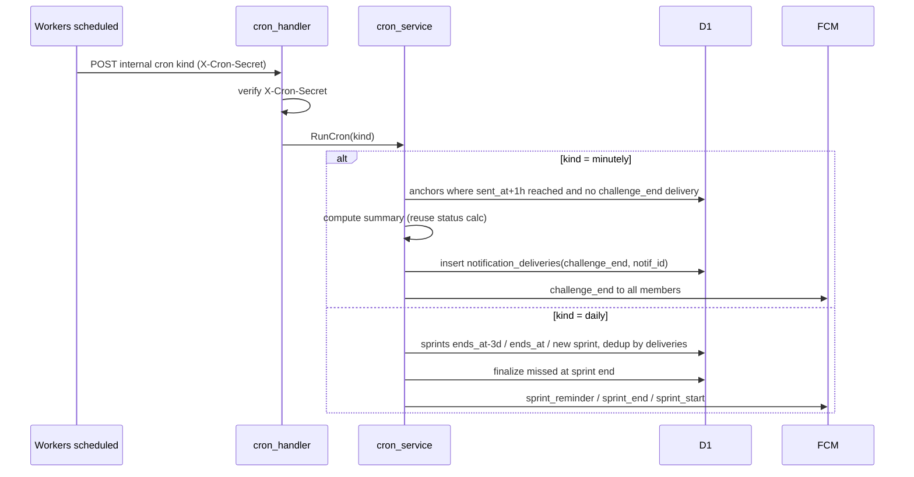

# Technical Design — begit-notifications

## Overview

本設計は BeGit; 通知機能の**バックエンド実装**（Go / Cloudflare Workers Container + D1 + R2 + FCM）を、承認済み要件（requirements.md Req1〜9）から具体的アーキテクチャへ落とす。既存 `begit-backend-api` 実装を拡張する **Extension** であり、通知①〜⑦の発火条件判定・データ永続化・FCM 配信を担う。iOS の画面実装は Out of Boundary（契約は [ios-guide.md](../../../docs/notification/ios-guide.md) §2）。

主要な構造追加は3点: (1) **Cron 経路**（Workers `scheduled()` → 内部 HTTP `/internal/cron` → `cron_service`）で時刻起点通知③④⑤⑥を駆動、(2) **FCM data メッセージ対応**＋**通知ペイロードビルダ**で ios-guide §2 契約を充足、(3) **draft 状態**と**送信済み状態**（`notification_deliveries`）のデータモデル追加。② Nice Work! は既存 Webhook 経路へ発火ロジックを統合する。

### Goals
- 通知①〜⑦をバックエンドが発火条件に応じて検知・生成・FCM 配信・永続化する。
- ① の時間的非共存により ② の anchor を一意化する。
- Cron 基盤（minutely/daily 2系統）を確立し ③④⑤⑥ を冪等に駆動する。
- FCM data ペイロードを ios-guide §2 契約に一致させる。

### Non-Goals
- iOS の `type` 別画面遷移・撮影・下書きプレフィル UI・バッジ表示（ios-guide 管轄）。
- 締切間際の催促通知（design.md §5、将来拡張）。
- Cloudflare アカウント/Terraform 等インフラ運用そのもの（`wrangler.toml` 設定値の追記は本 spec が示すが運用は spec 外）。

## Boundary Commitments

### This Spec Owns
- ①〜⑦ 通知の発火判定・データ永続化・FCM 送信（data ペイロード契約準拠）。
- ① 時間的非共存ルール（サービス層）。
- Webhook の `issues` イベント追加と ② Nice Work! 発火ロジック。
- `posts` の draft 状態、フィード除外、下書き取得/確定 API。
- Cron 基盤（`scheduled()` 受け口、`/internal/cron`、`cron_service`）と結果サマリ算出。
- 送信済み冪等状態 `notification_deliveries`。
- FCM data ペイロード契約（バックエンド側の生成責務、ios-guide §2 と一致）。

### Out of Boundary
- iOS 全般（遷移・撮影・UI・バッジ）。
- OpenAPI スキーマの iOS 側生成物・クライアント実装。
- 既存 Req1/2/7（認証・グループ・共通仕様）の変更（参照のみ）。

### Allowed Dependencies
- 既存 `begit-backend-api` の repository/service/handler 層・D1 スキーマ・`pkg/fcm`・`pkg/github`・`src/index.ts` 配線。
- Cloudflare Workers Cron Trigger / Container `getContainer().fetch()`。
- 依存方向 handler → service → repository → pkg を厳守（逆依存禁止）。

### Revalidation Triggers
- FCM data フィールド名/型の変更（ios-guide §2 と要同期）。
- 下書き取得/確定 API のスキーマ変更（OpenAPI ＋ ios-guide §4/§5）。
- `notification_deliveries` の冪等キー設計変更。
- Cron スケジュール（minutely/daily 区分）の変更。

## Architecture

### Existing Architecture Analysis
- **エントリ**: Workers (`src/index.ts`) が `fetch` で全リクエストを受け、`X-Internal-*` ヘッダーに Secrets/vars を載せて `getContainer(env.BEGIT_API,"begit-api-singleton").fetch()` で Go Container へ転送。
- **Go**: `cmd/server/container.go::buildHandler()` が pkg→repository→service→handler→gin routing を配線。層依存は handler→service→repository。
- **保持すべき統合点**: 既存エンドポイント（Req3/5/6）、`github_webhook_deliveries` 冪等、`GetNotificationStatus`、`fcm_token_repository.GetTokensByGroupID`。
- **回避する負債**: `webhook_service` への過剰ロジック集中を避け、② 発火は専用 service に分離。

### Architecture Pattern & Boundary Map



**Architecture Integration**:
- **Selected pattern**: Layered（既存踏襲）＋ Hybrid（既存拡張＋新規分離）。
- **境界分離**: 時刻起点（cron_service）/ Webhook起点（nicework_service）/ ユーザー操作起点（notification_service・social）を起点別に分離し共有所有を作らない。
- **保持パターン**: `X-Internal-*` 転送、delivery_id 冪等、handler→service→repository。
- **新規理由**: `cron_service`（新ライフサイクル）、`nicework_service`（webhook_service 肥大回避）、`notification_payload`（data 契約の単一責務化）。
- **Steering 準拠**: 逆依存禁止、snake_case、`pkg/` 外部連携。

### Technology Stack

| Layer | Choice / Version | Role in Feature | Notes |
|-------|------------------|-----------------|-------|
| Infrastructure / Runtime | Cloudflare Workers Cron Trigger + `[triggers] crons` | ③④⑤⑥ の時刻起点起動 | minutely/daily 2系統、`controller.cron` で振り分け |
| Entry | `src/index.ts`（TS, `@cloudflare/containers`） | `scheduled()` 追加・`/internal/cron` 転送 | 既存 `fetch` の secret 転送を再利用 |
| Backend / Services | Go + gin（既存） | 発火判定・サマリ算出・FCM 送信 | 新規 service 3つ追加 |
| Messaging / Events | FCM HTTP v1（`pkg/fcm` 拡張） | data メッセージ送信 | `notification`＋`data` 併存 |
| Data / Storage | Cloudflare D1（SQLite） | draft 状態・`notification_deliveries` | マイグレーション 0003 追加 |

## File Structure Plan

### Modified Files
- `backend/src/index.ts` — `scheduled(controller, env, ctx)` 追加。`X-Internal-*`＋`X-Cron-Secret` 付きで `POST /internal/cron?kind=minutely|daily` を Container へ。
- `backend/wrangler.toml` — `[triggers] crons = ["* * * * *", "0 0 * * *"]`（本番/dev）と `X-Cron-Secret`（dev は var、本番は secret）。
- `backend/cmd/server/container.go` — 新 service/handler 配線、`POST /internal/cron`（cron secret ガード）登録、social/notification への fcm 依存注入。
- `backend/cmd/server/main.go` — `Config` に `CronSecret` 追加、`configFromHeaders` に `X-Cron-Secret` 反映。
- `backend/pkg/fcm/client.go` — `SendToTokens` に `data map[string]string` 対応（`fcmMessageRequest.Message.Data`）。
- `backend/pkg/github/client.go` — `RegisterWebhook` の events に `issues` 追加。
- `backend/internal/service/webhook_service.go` — `issues` 受理、メンバー判定後 `nicework_service` 呼び出し。
- `backend/internal/service/notification_service.go` — `SendNotification` に時間非共存判定、begit_time data ペイロード化。
- `backend/internal/service/reaction_service.go` / `comment_service.go` — fcm 依存注入、⑦ 発火・自己抑制。
- `backend/internal/service/post_service.go` — draft 確定経路、feed 除外（repository 経由）。
- `backend/internal/repository/post_repository.go` — `ListByGroupID` で `is_draft=0` 除外、draft 作成/確定/anchor 関連クエリ。
- `backend/internal/repository/notification_repository.go` — 「スプリント内・時刻以前で最新の通知」「アクティブ通知有無」クエリ。
- `backend/internal/repository/sprint_repository.go` — Cron 用走査（ends_at 近傍・終了済み・新規生成）クエリ。

### New Files
```
backend/
├── migrations/
│   └── 0003_notifications_draft_and_deliveries.sql   # is_draft 列 + notification_deliveries
├── internal/
│   ├── service/
│   │   ├── nicework_service.go        # ② 発火: member→anchor→idempotent→draft→on_time/late→FCM
│   │   ├── cron_service.go            # ③④⑤⑥ 駆動 (kind 振り分け)
│   │   └── notification_payload.go    # ①〜⑦ data ペイロードビルダ (type別フィールド)
│   ├── repository/
│   │   └── notification_delivery_repository.go  # 送信済み冪等 (kind, ref_id)
│   └── handler/
│       └── cron.go                    # POST /internal/cron (X-Cron-Secret ガード)
```

## System Flows

### ② Nice Work!（Webhook 駆動）



### ③④⑤⑥ Cron 駆動



> 冪等の要: `notification_deliveries.UNIQUE(kind, ref_id)` への INSERT が成功した場合のみ FCM 送信。再実行は UNIQUE 違反で skip。

## Requirements Traceability

| Requirement | Summary | Components | Interfaces | Flows |
|-------------|---------|------------|------------|-------|
| 1.1–1.5 | BeGit Time! 発行＋時間非共存 | notification_service, notification_repository | `SendNotification`, active-notif query | — |
| 2.1–2.8 | Nice Work! 発火 | nicework_service, webhook_service, post_repository | `HandleActivity`, anchor query, draft insert | ② flow |
| 3.1–3.4 | チャレンジ終了 Cron | cron_service, notification_delivery_repository | `RunCron(minutely)` | ③ flow |
| 4.1–4.4 | スプリント系 Cron | cron_service, sprint_repository | `RunCron(daily)` | Cron flow |
| 5.1–5.3 | ⑦ ソーシャル | reaction_service, comment_service, notification_payload | `AddReaction`/`CreateComment` 拡張 | — |
| 6.1–6.4 | FCM data 契約 | notification_payload, pkg/fcm | `SendToTokens(data)` | — |
| 7.1–7.5 | draft 管理 | post_service, post_repository, migration 0003 | feed 除外, draft 取得/確定 API | — |
| 8.1–8.5 | Webhook 拡張＋冪等 | webhook_service, pkg/github, github_webhook_deliveries | `issues` 追加, delivery_id | ② flow |
| 9.1–9.4 | Cron 基盤＋サマリ | src/index.ts, cron_handler, cron_service, notification_delivery_repository | `scheduled()`, `/internal/cron` | Cron flow |

## Components and Interfaces

| Component | Domain/Layer | Intent | Req Coverage | Key Dependencies (P0/P1) | Contracts |
|-----------|--------------|--------|--------------|--------------------------|-----------|
| notification_payload | service | ①〜⑦ の FCM data を type 別に構築 | 6.1–6.3 | pkg/fcm (P0) | Service |
| pkg/fcm (拡張) | pkg | data メッセージ送信 | 6.1–6.4 | FCM HTTP v1 (P0) | Service/External |
| notification_service (拡張) | service | ① 発行＋時間非共存 | 1.1–1.5 | notif_repo, sprint_repo, payload (P0) | Service |
| nicework_service | service | ② 検知→draft→本人FCM | 2.1–2.8 | post_repo, notif_repo, github, payload (P0) | Service |
| webhook_service (拡張) | service | issues 受理＋② 委譲 | 8.1,8.5,2.1,2.2 | nicework_service (P0) | Service |
| cron_service | service | ③④⑤⑥ 駆動 | 3.x,4.x,9.x | delivery_repo, sprint_repo, notif_repo, payload (P0) | Batch |
| cron_handler | handler | /internal/cron 受理 | 9.1,9.2 | cron_service (P0), cron secret (P0) | API |
| notification_delivery_repository | repository | 送信済み冪等 | 3.3,4.4,9.4 | D1 (P0) | State |
| reaction/comment_service (拡張) | service | ⑦ 発火＋自己抑制 | 5.1–5.3 | post_repo, fcm, payload (P0) | Service |
| post_service/repository (拡張) | service/repo | draft 除外・確定 | 7.1–7.5 | D1 (P0) | Service/API/State |

### Service Layer

#### notification_payload（ペイロードビルダ）

| Field | Detail |
|-------|--------|
| Intent | type 別に ios-guide §2 準拠の `map[string]string` data を構築し送信を一元化 |
| Requirements | 6.1, 6.2, 6.3 |

**Responsibilities & Constraints**
- 全 data に `type`・`group_id` を含め、値はすべて文字列（数値は `strconv` で文字列化）。
- type 別追加フィールドは ios-guide §2 と一致（例 `nice_work`: `notification_id`/`draft_post_id`/`status`）。
- `notification`（title/body 表示文）も併せて設定。

**Contracts**: Service [x]
```go
type Payload struct {
    Notification fcm.Notification // title/body 表示
    Data         map[string]string // type 等（全て文字列）
}
// 例: BuildNiceWork(groupID, notifID, draftPostID int64, status string) Payload
// 例: BuildChallengeEnd(groupID, notifID int64) Payload など type 毎に1関数
```
- Preconditions: 必須 ID は正。status ∈ {on_time, late}。
- Postconditions: `Data["type"]` が所定の値。`Data` の全値が文字列。

#### nicework_service（② 発火）

| Field | Detail |
|-------|--------|
| Intent | Webhook 検知アクティビティから ② を発火 |
| Requirements | 2.1–2.8 |

**Responsibilities & Constraints**
- メンバー判定（送信者 login → user → group_members）。
- anchor 特定: 同一スプリント内・検知時刻以前で最新の begit_time 通知。
- 冪等: draft INSERT を `posts.UNIQUE(notification_id,user_id)` で先取り。違反＝既発火で skip（再発火しない）。
- on_time/late: 検知時刻 vs `anchor.sent_at + 1h`。
- 本人のみへ `nice_work` data 送信。

**Dependencies**
- Inbound: webhook_service — 委譲（P0）
- Outbound: post_repository（draft）, notification_repository（anchor）, github（検知データ）, notification_payload+fcm（P0）

**Contracts**: Service [x]
```go
type NiceWorkService interface {
    HandleActivity(ctx context.Context, groupID int64, senderLogin, postType string,
        detected ActivityData) error // 冪等・anchor 無しは no-op
}
```
- Invariants: 1 チャレンジ 1 ユーザー 1 draft。グループ全体へは送らない。

#### cron_service（③④⑤⑥）

| Field | Detail |
|-------|--------|
| Intent | kind 別に時刻起点通知を冪等発火 |
| Requirements | 3.1–3.4, 4.1–4.4, 9.1–9.4 |

**Contracts**: Batch [x]
- **Trigger**: `POST /internal/cron?kind=minutely|daily`（Workers scheduled 経由）。
- **Input/validation**: kind ∈ {minutely, daily}。X-Cron-Secret 一致必須。
- **処理 (minutely)**: `sent_at + 1h <= now` かつ `notification_deliveries` に `(challenge_end, notif_id)` 無い anchor を抽出 → サマリ算出（On Time/Late/Missed、`GetNotificationStatus` 共通化）→ delivery INSERT 成功時のみ全員へ `challenge_end`。
- **処理 (daily)**: ④ `ends_at` の3日前到達スプリント→`sprint_reminder`；⑤ `ends_at` 到達→missed 確定＋まとめ→`sprint_end`；⑥ 新スプリント INSERT 検知→`sprint_start`。各々 `notification_deliveries(kind, sprint_id)` で冪等。
- **Idempotency & recovery**: 全送信は delivery INSERT 成功が前提。再実行・二重起動は UNIQUE 違反で skip。FCM 送信失敗はベストエフォート（発火元失敗にしない、6.4）。

#### reaction_service / comment_service（⑦ 拡張）

**Responsibilities & Constraints**
- リアクション/コメント成功後、投稿者 `post.user_id` を取得。
- 自己抑制: actor == post.user_id なら送信しない（5.3）。
- 本人へ `reaction`/`comment` data（`post_id`/`actor_login`）送信。FCM 失敗は本処理を失敗させない。

**Dependencies**: Outbound post_repository（投稿者特定）, fcm_token_repository, notification_payload+fcm（P0）。

### Handler Layer

#### cron_handler（`POST /internal/cron`）

**Contracts**: API [x]

| Method | Endpoint | Request | Response | Errors |
|--------|----------|---------|----------|--------|
| POST | /internal/cron?kind= | header `X-Cron-Secret` | 200 `{"status":"ok"}` | 403（secret 不一致）, 400（kind 不正）|

**Implementation Notes**
- Integration: gin に bearer ミドルウェア無しで登録。`X-Cron-Secret` を `cfg.CronSecret` と定数時間比較。Worker 経由のみ到達（公開しない）。
- Risks: secret 漏洩時の不正起動 → Workers Secret 管理＋冪等で実害限定。

### Data Layer

#### post_repository / post_service（draft）

**Contracts**: Service [x] / API [x] / State [x]
- `ListByGroupID` は `is_draft = 0` のみ返す（7.3）。
- draft 作成（② 経由、`is_draft=1`）／確定（`is_draft=0` に更新、べき等）。
- 下書き取得・確定 API（7.5、OpenAPI が正）:

| Method | Endpoint | Request | Response | Errors |
|--------|----------|---------|----------|--------|
| GET | /groups/:id/posts/:postId/draft | — | draft 投稿（プレフィル元） | 403, 404 |
| POST | /groups/:id/posts/:postId/confirm | 確定ボディ（body/写真参照等） | 確定後 post | 403, 404, 409 |

> 正確なスキーマは OpenAPI が正。ios-guide §4/§5 と同期する。

## Data Models

### Logical Data Model（変更分）

- **posts**: `is_draft INTEGER NOT NULL DEFAULT 0` を追加。`is_draft=1` はフィード除外。写真有無とは独立（7.1）。既存 `status`（on_time/late/missed/null）は維持。
- **notification_deliveries**（新規）: Cron 通知の送信済み冪等。

### Physical Data Model（migration 0003）

```sql
-- posts に draft フラグ追加（写真有無と独立）
ALTER TABLE posts ADD COLUMN is_draft INTEGER NOT NULL DEFAULT 0;

-- Cron 通知の送信済み冪等（③④⑤⑥）
CREATE TABLE IF NOT EXISTS notification_deliveries (
  id         INTEGER PRIMARY KEY AUTOINCREMENT,
  kind       TEXT    NOT NULL,   -- 'challenge_end' | 'sprint_reminder' | 'sprint_end' | 'sprint_start'
  ref_id     INTEGER NOT NULL,   -- challenge_end=notification_id, sprint_*=sprint_id
  sent_at    TEXT    NOT NULL DEFAULT (datetime('now')),
  UNIQUE(kind, ref_id)
);
```

> 既存 `0001_initial.sql` の `posts.status`/`UNIQUE(notification_id,user_id)`、`github_webhook_deliveries` を流用。`is_draft` 既存行はデフォルト 0（＝非 draft）で後方互換。

### Data Contracts & Integration（FCM data ペイロード）

ios-guide §2 準拠（全値文字列）:
- 共通: `type`, `group_id`
- `begit_time`: `notification_id`, `sprint_id`
- `nice_work`: `notification_id`(anchor), `draft_post_id`, `status`(on_time|late)
- `challenge_end`: `notification_id`
- `sprint_reminder`/`sprint_end`/`sprint_start`: `sprint_id`
- `reaction`/`comment`: `post_id`, `actor_login`

## Error Handling

### Error Strategy
- **FCM 送信失敗**: ベストエフォート（6.4）。トークン単位失敗は継続、全滅時のみログ。発火元（API/Cron）は成功扱い。
- **時間非共存（①）**: アクティブ通知存在で 409 Conflict（1.3）。`UNIQUE(sprint_id,sent_by)` 違反も 409（1.2）。
- **Webhook**: 署名不一致 403（8.2）、重複 delivery は 200 skip（8.3）、対応グループ無し 200 無視（8.5）。
- **② 冪等衝突**: draft INSERT の UNIQUE 違反は正常系 skip（エラーにしない）。
- **Cron**: kind 不正 400、secret 不一致 403。delivery UNIQUE 違反は正常系 skip。

### Monitoring
- Cron 実行件数・送信済み skip 件数・FCM 失敗件数を `log.Printf`（既存パターン）。

## Testing Strategy

### Unit Tests
- notification_service: 時間非共存判定（アクティブ有/無、同一ユーザー再発行）。
- nicework_service: anchor 特定（時刻以前最新）、冪等 skip（既 draft）、on_time/late 境界（sent_at+1h ちょうど）。
- notification_payload: type 別 data フィールド・全値文字列化。
- notification_delivery_repository: UNIQUE(kind, ref_id) 冪等。
- post_repository: `ListByGroupID` の is_draft=0 除外。

### Integration Tests
- Webhook push/issues/pr_review → ② 発火（メンバー判定・本人のみ送信・グループ非送信）。
- Cron minutely → challenge_end 1回（再実行で skip）。
- Cron daily → sprint_reminder/end/start の冪等。
- ⑦ リアクション/コメント → 投稿者通知・自己抑制。
- draft 確定 → feed 表示遷移。

### E2E（ローカル）
- `wrangler dev --test-scheduled` で `/__scheduled` 経由の Cron 経路疎通。

## Security Considerations
- `/internal/cron` は bearer 不要だが `X-Cron-Secret`（Workers Secret）一致を定数時間比較で必須化。公開ルーティングに載せず Worker 経由のみ到達。
- Webhook 署名（HMAC-SHA256）は既存どおり必須（8.2）。
- FCM サービスアカウント・GitHub トークンは既存の Secrets/暗号化方針を踏襲。

## Migration Strategy
- `0003_notifications_draft_and_deliveries.sql` を `wrangler d1 migrations apply`（本番/dev）。`is_draft` はデフォルト 0 で既存行は非 draft 扱い、後方互換。ロールバックは列追加とテーブル追加のみのため低リスク（drop で戻せる）。
