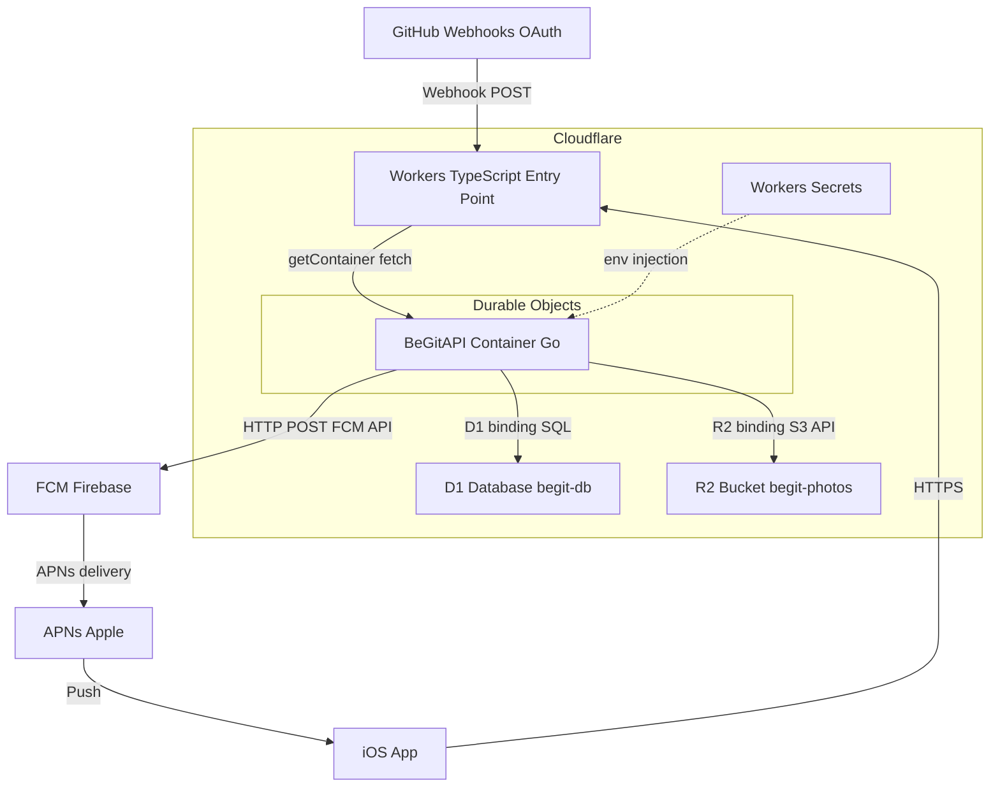
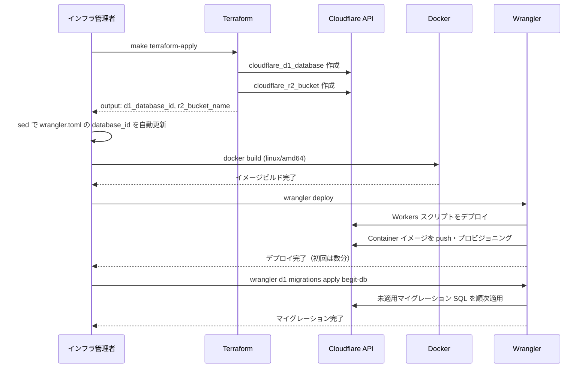
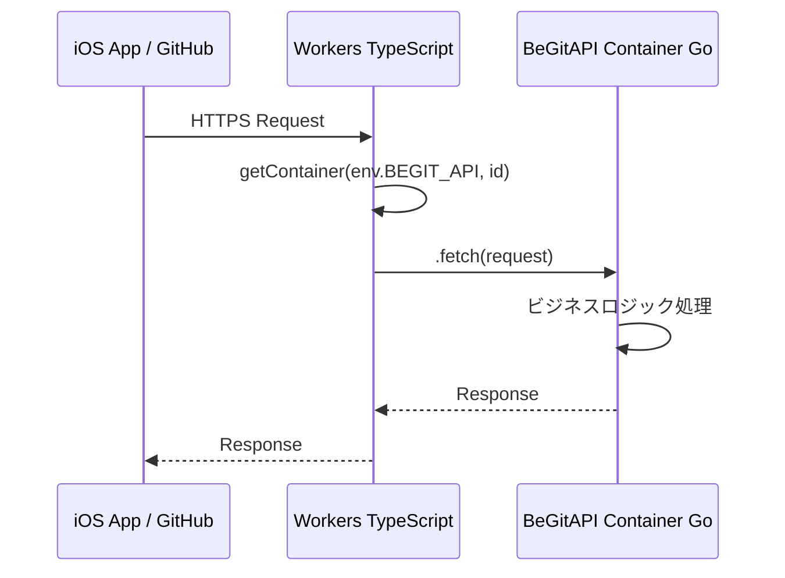
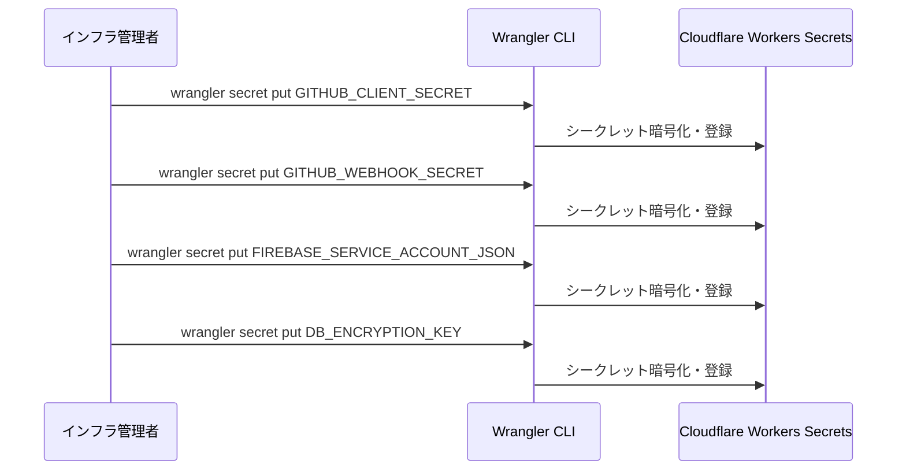

# 技術設計書: cloudflare-infra

## Overview

BeGit のインフラ基盤を Cloudflare プラットフォーム上に構築する。Terraform (cloudflare provider) で D1 データベースと R2 バケットを宣言的に作成し、Wrangler で Workers エントリーポイント（TypeScript）と Workers Container（Go API）をデプロイする。シークレットは Wrangler Secrets で管理し、D1 スキーマは Wrangler マイグレーションで適用する。

インフラ管理者は `terraform apply` → `wrangler deploy` → `wrangler d1 migrations apply` の 3 ステップでインフラ全体をゼロから再現できる。Workers Container は Durable Objects ベースのアーキテクチャで動作し、TypeScript Worker スクリプトがルーティングエントリーポイントとして Go コンテナへリクエストを転送する。

### Goals

- Cloudflare プラットフォーム上のリソース（D1・R2・Workers・Container）を IaC で再現可能な状態に保つ
- Terraform と Wrangler の役割を明確に分離し、各ツールの得意領域を活用する
- 4 種類のシークレットをソースコードや state ファイルに平文で記録せず安全に管理する
- iOS クライアントからのリクエストと GitHub Webhook を Workers Container（Go）に確実に転送する

### Non-Goals

- Go バックエンドのビジネスロジック実装（別 spec でカバー）
- Firebase プロジェクト本体の作成（Firebase コンソールで手動作成）
- iOS クライアント側の APNs 設定・Firebase SDK 組み込み
- GitHub Webhook 設定画面の操作
- R2 バケットへの iOS からの直接アクセス（Workers 経由のみ）
- 本番グレードの高可用性・マルチリージョン構成

---

## Boundary Commitments

### This Spec Owns

- `infra/terraform/` 以下の Terraform 構成ファイル（D1・R2 リソース定義）
- `backend/wrangler.toml`（Workers・Container・D1/R2 binding 設定）
- `backend/src/index.ts`（Workers TypeScript エントリーポイント・Container クラス定義）
- `backend/Dockerfile`（Go API の linux/amd64 コンテナイメージ定義）
- `backend/migrations/` 以下の D1 マイグレーション SQL ファイル（初期スキーマ）
- `Makefile` への `deploy`・`secrets-init` ターゲット追加
- Terraform state ファイル管理方針（local backend）

### Out of Boundary

- `backend/internal/`・`backend/cmd/` 等の Go ビジネスロジック実装
- D1 スキーマの最終設計（backend API 実装 spec と連携して決定）
- Firebase プロジェクト・サービスアカウント作成手順
- GitHub OAuth App・Webhook 登録手順
- iOS の APNs デバイストークン登録フロー

### Allowed Dependencies

- Cloudflare アカウント（Account ID・API Token）
- Firebase プロジェクト（Firebase コンソールで作成済みであること）
- `wrangler` CLI（最新版）
- `terraform` CLI（v1.x）・cloudflare provider（v4+）
- Docker（linux/amd64 ビルド環境）

### Revalidation Triggers

- D1 スキーマ変更（マイグレーション追加）→ backend API 実装 spec に通知
- Workers の URL 変更 → iOS クライアント側の API エンドポイント設定確認
- `wrangler.toml` の binding 名変更 → Go コードの環境変数参照名を合わせる必要あり
- Terraform provider バージョンアップ → リソース名・引数の互換性確認

---

## Architecture

### Architecture Pattern & Boundary Map



**Architecture Integration:**
- Workers Container は Durable Objects として実装される。TypeScript Worker が `getContainer(env.BEGIT_API, id).fetch(request)` でシングルトン DO インスタンスに転送する（研究記録: `research.md` Decision: Workers Container の DO ID 戦略）
- Terraform は D1・R2 のリソース作成のみを担当。Workers・Container のデプロイは Wrangler が担当（Workers Containers は Terraform 非対応）
- シークレットは Wrangler Secrets に格納し、Container の環境変数として注入される。Terraform state には一切記録しない

### Technology Stack

| Layer | Choice / Version | Role | Notes |
|-------|-----------------|------|-------|
| IaC (リソース作成) | Terraform v1.x + cloudflare provider v4+ | D1・R2 リソースの宣言的作成 | Workers Containers は対象外 |
| デプロイ | Wrangler CLI (最新版) | Workers・Container・Secrets・Migration | `wrangler.toml` が設定のソース |
| Workers スクリプト | TypeScript (`@cloudflare/containers`) | ルーティング + Container クラス定義 | Container の `sleepAfter` はここで設定 |
| Go コンテナイメージ | Docker (linux/amd64) | Go API サーバーのコンテナ化 | multi-stage build で軽量化 |
| DB | Cloudflare D1 (SQLite 互換) | メインデータストア | `wrangler d1 migrations apply` で管理 |
| ストレージ | Cloudflare R2 (S3 互換) | 写真ストレージ | egress コストなし |
| シークレット | Cloudflare Workers Secrets | API キー等の機密情報管理 | `wrangler secret put` で登録 |

---

## File Structure Plan

### Directory Structure

```
infra/
  terraform/
    main.tf                    # provider 設定・terraform backend（local）
    variables.tf               # account_id・api_token 変数定義
    outputs.tf                 # d1_database_id・r2_bucket_name 出力
    d1.tf                      # cloudflare_d1_database "begit_db" リソース
    r2.tf                      # cloudflare_r2_bucket "begit_photos" リソース
    terraform.tfvars.example   # シークレット除外のサンプル（account_id のみ）

backend/
  Dockerfile                   # Go API の linux/amd64 multi-stage ビルド
  wrangler.toml                # Workers + Container + D1/R2 binding 設定
  package.json                 # wrangler・@cloudflare/containers 依存
  src/
    index.ts                   # Worker fetch handler + BeGitAPI Container クラス
  migrations/
    0001_initial.sql           # D1 初期スキーマ（テーブル定義プレースホルダー）

Makefile                       # deploy・secrets-init ターゲット追加（既存に追記）
```

### Modified Files

- `Makefile` — `deploy`（デプロイ全工程）・`secrets-init`（シークレット登録手順表示）・`terraform-apply`（terraform apply + wrangler.toml の database_id 自動更新）ターゲットを追加

---

## System Flows

### デプロイフロー



### リクエスト転送フロー



### シークレット登録フロー



---

## Requirements Traceability

| Requirement | Summary | Components | Interfaces | Flows |
|-------------|---------|------------|------------|-------|
| 1.1 | D1・R2・Container binding を wrangler.toml に定義 | wrangler.toml | D1/R2/Container binding | デプロイフロー |
| 1.2 | terraform apply で Workers リソース作成 | Terraform D1/R2 | Terraform CLI | デプロイフロー |
| 1.3 | リクエストを Container エンドポイントへ転送 | Workers Entry Point | Worker fetch handler | リクエスト転送フロー |
| 1.4 | apply 失敗時にエラー表示・state 記録 | Terraform | Terraform CLI | — |
| 1.5 | Cloudflare の自動 HTTPS・CDN | Workers Entry Point | Cloudflare ネットワーク | — |
| 2.1 | linux/amd64 Docker イメージビルド・push | Dockerfile | docker build | デプロイフロー |
| 2.2 | wrangler deploy で Container プロビジョニング | wrangler.toml | wrangler deploy | デプロイフロー |
| 2.3 | sleepAfter によるアイドルスリープ | Workers Entry Point (index.ts) | BeGitAPI.sleepAfter | — |
| 2.4 | D1・R2・FCM・GitHub API へのアクセス | wrangler.toml bindings + Secrets | Env bindings | リクエスト転送フロー |
| 2.5 | ビルド失敗時のデプロイ中断 | Dockerfile・Makefile | docker build exit code | デプロイフロー |
| 3.1 | `begit-db` D1 データベース作成 | Terraform D1 | cloudflare_d1_database | デプロイフロー |
| 3.2 | 未適用マイグレーションの順次適用 | migrations/ | wrangler d1 migrations apply | デプロイフロー |
| 3.3 | SQL 文法エラー時のマイグレーション中断 | migrations/ | wrangler CLI | — |
| 3.4 | SQLite 方言のマイグレーション SQL | migrations/ | SQL ファイル | — |
| 3.5 | wrangler.toml binding 経由での D1 アクセス | wrangler.toml | d1_databases binding | リクエスト転送フロー |
| 4.1 | `begit-photos` R2 バケット作成 | Terraform R2 | cloudflare_r2_bucket | デプロイフロー |
| 4.2 | S3 互換 API による Workers Container からのアクセス | wrangler.toml | r2_buckets binding | リクエスト転送フロー |
| 4.3 | wrangler.toml binding 経由での R2 アクセス | wrangler.toml | r2_buckets binding | リクエスト転送フロー |
| 4.4 | egress コストなし設定 | Terraform R2 | cloudflare_r2_bucket | — |
| 4.5 | R2 アップロード失敗時のエラーレスポンス | Workers Entry Point / Go | HTTP error response | — |
| 5.1 | 4 種類のシークレット登録 | Secrets Management | wrangler secret put | シークレット登録フロー |
| 5.2 | シークレットを環境変数として参照 | wrangler.toml / Secrets | Env injection | — |
| 5.3 | シークレット値を state・コードに平文記録しない | Secrets Management | wrangler secret put | — |
| 5.4 | シークレット未登録時の適切なエラー | Workers Entry Point | HTTP error response | — |
| 5.5 | wrangler secret put で上書き登録 | Secrets Management | wrangler secret put | — |
| 6.1 | FIREBASE_SERVICE_ACCOUNT_JSON 登録 | Secrets Management | wrangler secret put | シークレット登録フロー |
| 6.2 | FCM HTTP API への JWT 認証リクエスト | Go（別 spec） | — | — |
| 6.3 | APNs との直接接続を FCM に委譲 | アーキテクチャ方針 | — | — |
| 6.4 | FCM 失敗時のエラーログ・通知 | Go（別 spec） | — | — |
| 6.5 | Firebase プロジェクト作成済みを前提 | 前提条件 | — | — |
| 7.1 | GITHUB_WEBHOOK_SECRET 登録 | Secrets Management | wrangler secret put | シークレット登録フロー |
| 7.2 | HMAC-SHA256 署名検証 | Go（別 spec） | — | — |
| 7.3 | 署名検証失敗時の 403 レスポンス | Go（別 spec） | — | — |
| 7.4 | GitHub Webhook 受信用の公開 URL | Workers Entry Point | Workers デフォルト URL | — |
| 8.1 | cloudflare provider で D1・R2 定義 | Terraform D1/R2 | Terraform HCL | デプロイフロー |
| 8.2 | terraform plan で差分確認 | Terraform | Terraform CLI | — |
| 8.3 | terraform apply でリソース作成 + wrangler.toml 自動更新 | Terraform D1/R2, Makefile terraform-apply | Terraform CLI, sed | デプロイフロー |
| 8.4 | シークレットを tfvars・state に平文記録しない | Terraform | tfvars.example | — |
| 8.5 | state をローカル保存・1 名管理（ハッカソンスコープ） | Terraform | local backend | — |
| 8.6 | apply エラー時の影響範囲特定 | Terraform | Terraform CLI | — |
| 9.1 | Docker build → wrangler deploy → migration の順序 | Makefile deploy ターゲット | make deploy | デプロイフロー |
| 9.2 | wrangler deploy で Workers + Container 反映 | wrangler.toml | wrangler deploy | デプロイフロー |
| 9.3 | 未適用マイグレーションのみ適用 | migrations/ | wrangler d1 migrations apply | — |
| 9.4 | wrangler dev / d1 execute でローカル操作 | wrangler.toml | wrangler dev | — |
| 9.5 | プロビジョニング未完了時の待機 | wrangler deploy | Wrangler CLI | デプロイフロー |

---

## Components and Interfaces

### コンポーネントサマリー

| Component | Layer | Intent | Req Coverage | Key Dependencies | Contracts |
|-----------|-------|--------|--------------|------------------|-----------|
| Terraform D1/R2 | IaC | D1・R2 リソースの宣言的作成 | 1.2, 3.1, 4.1, 8.1–8.6 | cloudflare provider v4+ (P0) | Batch |
| Workers Entry Point | Workers | ルーティング + Container クラス定義 | 1.1, 1.3, 1.5, 2.3, 2.4, 7.4 | @cloudflare/containers (P0) | API, Service |
| Dockerfile | Container | Go API の linux/amd64 イメージ定義 | 2.1, 2.5 | Docker (P0) | Batch |
| wrangler.toml | 設定 | Workers・Container・D1/R2 binding 設定 | 1.1, 2.2, 3.5, 4.3, 5.2 | Wrangler CLI (P0) | State |
| Secrets Management | 運用 | 4 シークレットの安全な登録・管理 | 5.1–5.5, 6.1, 7.1 | Wrangler CLI (P0) | Batch |
| D1 Migrations | DB | SQLite 方言スキーマ管理 | 3.2–3.4 | Wrangler CLI (P0) | Batch |
| Makefile terraform-apply | 自動化 | terraform apply + wrangler.toml database_id 自動更新 | 8.3, 3.1 | Terraform CLI, sed (P0) | Batch |
| Makefile deploy | 自動化 | デプロイ全工程のオーケストレーション | 9.1 | 上記全コンポーネント (P0) | Batch |

---

### IaC Layer

#### Terraform D1/R2

| Field | Detail |
|-------|--------|
| Intent | D1 データベースと R2 バケットを cloudflare provider で宣言的に作成する |
| Requirements | 1.2, 3.1, 4.1, 4.4, 8.1, 8.2, 8.3, 8.4, 8.5, 8.6 |

**Responsibilities & Constraints**
- `cloudflare_d1_database` リソースで `begit-db` を作成し、ID を `outputs.tf` に出力する
- `cloudflare_r2_bucket` リソースで `begit-photos` を作成する
- `terraform.tfvars` にはシークレット値を含めない。`CLOUDFLARE_API_TOKEN` は環境変数 `TF_VAR_cloudflare_api_token` で渡す
- Terraform state は local backend（`terraform.tfstate`）。`.gitignore` で除外する

**Dependencies**
- External: Cloudflare API（`cloudflare_api_token`・`cloudflare_account_id`）— リソース作成 (P0)
- External: cloudflare provider `~> 4` — リソーススキーマ (P0)

**Contracts**: Batch [x]

##### Batch / Job Contract
- Trigger: `terraform apply`
- Input: `cloudflare_account_id`（`terraform.tfvars`）、`cloudflare_api_token`（環境変数）
- Output: `d1_database_id`（`terraform output d1_database_id`）、`r2_bucket_name`
- Idempotency: Terraform が state で冪等性を保証

**Implementation Notes**
- `terraform.tfvars.example` を作成し、シークレットを除いたサンプル値を記載する
- `terraform.tfstate` と `terraform.tfvars` は `.gitignore` に追加する
- Workers Containers は Terraform 非対応のため、Workers リソース（`cloudflare_worker` 等）は本 spec の Terraform 管理対象外

---

### Workers Layer

#### Workers Entry Point

| Field | Detail |
|-------|--------|
| Intent | HTTPS リクエストを受信し、`BeGitAPI` Durable Object（Container）へ転送する TypeScript Worker |
| Requirements | 1.1, 1.3, 1.5, 2.3, 2.4, 5.2, 5.4, 7.4 |

**Responsibilities & Constraints**
- `fetch` エクスポートで全リクエストを受信し、`getContainer` でシングルトン Container DO に転送する
- `BeGitAPI extends Container` クラスで `defaultPort = 8080` と `sleepAfter = "10m"` を定義する
- D1・R2・Secrets の binding を `Env` 型で参照できる型定義を持つ
- Workers Containers は Durable Objects として動作するため、`[[durable_objects.bindings]]` と `[[migrations]]` が必須

**Dependencies**
- External: `@cloudflare/containers` パッケージ — Container クラス・getContainer (P0)
- External: `@cloudflare/workers-types` — Env 型定義 (P1)
- Outbound: BeGitAPI Container — fetch proxy (P0)

**Contracts**: API [x], Service [x]

##### Service Interface

```typescript
interface Env {
  BEGIT_API: DurableObjectNamespace;
  DB: D1Database;
  PHOTOS: R2Bucket;
  GITHUB_CLIENT_SECRET: string;
  GITHUB_WEBHOOK_SECRET: string;
  FIREBASE_SERVICE_ACCOUNT_JSON: string;
  DB_ENCRYPTION_KEY: string;
}

export class BeGitAPI extends Container {
  defaultPort: number;    // = 8080
  sleepAfter: string;     // = "10m"
}

export default {
  fetch(request: Request, env: Env, ctx: ExecutionContext): Promise<Response>;
};
```

**Implementation Notes**
- Integration: `getContainer(env.BEGIT_API, env.BEGIT_API.idFromName("begit-api-singleton")).fetch(request)` でシングルトン DO に転送
- Validation: シークレット未登録時は Container 内の Go ロジックが 500/403 を返す（Worker 側での検証は不要）
- Risks: Container のコールドスタート（`sleepAfter` 後）により初回レスポンスに数秒の遅延が発生する。デモ前ウォームアップを `make warmup` ターゲットとして追加する

---

### Container Layer

#### Dockerfile

| Field | Detail |
|-------|--------|
| Intent | Go API サーバーを linux/amd64 の軽量コンテナイメージとしてビルドする |
| Requirements | 2.1, 2.5 |

**Responsibilities & Constraints**
- `--platform=linux/amd64` 指定の multi-stage ビルドで軽量 alpine イメージを生成する
- ビルド失敗時は exit code 非ゼロで `make deploy` を中断する
- `EXPOSE 8080` で `defaultPort` と一致させる
- 実行ユーザーは非 root（セキュリティ要件）

**Contracts**: Batch [x]

##### Batch / Job Contract
- Trigger: `docker build --platform linux/amd64 -t begit-api .`
- Input: `backend/` ディレクトリ（Go ソースコード）
- Output: linux/amd64 Docker イメージ
- Idempotency: 同一ソースからは同一イメージを生成（layer cache 活用）

---

### Configuration Layer

#### wrangler.toml

| Field | Detail |
|-------|--------|
| Intent | Workers・Container・D1/R2 binding の設定ソース |
| Requirements | 1.1, 2.2, 2.3, 3.5, 4.3, 5.2, 9.2, 9.4 |

**Responsibilities & Constraints**
- `[[containers]]` に `class_name = "BeGitAPI"`・`image = "./Dockerfile"`・`max_instances = 1` を定義する
- `[[durable_objects.bindings]]` で `name = "BEGIT_API"` を定義する
- `[[migrations]]` に `tag = "v1"`, `new_classes = ["BeGitAPI"]` を定義する
- `[[d1_databases]]` に `binding = "DB"`, `database_name = "begit-db"`, `database_id = "<terraform-output>"` を定義する
- `[[r2_buckets]]` に `binding = "PHOTOS"`, `bucket_name = "begit-photos"` を定義する
- シークレット値は記載しない（`vars` セクションへの平文記載禁止）

**Contracts**: State [x]

##### State Management
- State model: `wrangler.toml` が Workers 設定の唯一の source of truth
- Persistence: Git 管理（`database_id` はプレースホルダーコメントで初期状態を示す）
- Concurrency: Wrangler が逐次デプロイを保証

---

### Secrets Management Layer

#### Secrets Management

| Field | Detail |
|-------|--------|
| Intent | 4 種類のシークレットを Cloudflare Workers Secrets に安全に登録・管理する |
| Requirements | 5.1, 5.2, 5.3, 5.4, 5.5, 6.1, 7.1 |

**Responsibilities & Constraints**
- 以下の 4 シークレットを `wrangler secret put` で登録する:
  1. `GITHUB_CLIENT_SECRET` — GitHub OAuth
  2. `GITHUB_WEBHOOK_SECRET` — Webhook HMAC 署名検証
  3. `FIREBASE_SERVICE_ACCOUNT_JSON` — FCM 認証（JSON 文字列として登録）
  4. `DB_ENCRYPTION_KEY` — GitHub アクセストークン暗号化
- シークレット値は Terraform state・Git・`wrangler.toml` に記録しない
- 既存シークレットの上書きは `wrangler secret put <KEY>` で実行する

**Contracts**: Batch [x]

##### Batch / Job Contract
- Trigger: `make secrets-init`（手順表示）→ 管理者が各 `wrangler secret put` を実行
- Input: 各シークレット値（標準入力または `--stdin` フラグ）
- Output: Cloudflare Workers Secrets に暗号化保存、Container 起動時に環境変数として注入
- Idempotency: 同一キーへの再登録は上書き（冪等）

---

### DB Migration Layer

#### D1 Migrations

| Field | Detail |
|-------|--------|
| Intent | SQLite 方言の D1 スキーマを Wrangler マイグレーションで管理する |
| Requirements | 3.2, 3.3, 3.4, 9.3 |

**Responsibilities & Constraints**
- `migrations/` ディレクトリに連番プレフィックス（`0001_`, `0002_`, ...）で SQL ファイルを配置する
- SQL は SQLite 方言のみ使用（PostgreSQL 方言は禁止: `SERIAL` → `INTEGER PRIMARY KEY AUTOINCREMENT`）
- 文法エラーが含まれる SQL ファイルはマイグレーション中断とし、エラーメッセージを出力する
- 適用済みマイグレーションはスキップされる（Wrangler が管理）

**Contracts**: Batch [x]

##### Batch / Job Contract
- Trigger: `wrangler d1 migrations apply begit-db`
- Input: `migrations/` 以下の未適用 `.sql` ファイル
- Output: D1 データベースへのスキーマ適用
- Idempotency: 適用済みファイルはスキップ（Wrangler が migration テーブルで管理）

---

## Data Models

### D1 スキーマ（初期プレースホルダー）

本 spec では初期スキーマのプレースホルダーとして `0001_initial.sql` を作成する。テーブルの最終設計は backend API 実装 spec と連携して確定する。

**SQLite 方言制約:**
- `INTEGER PRIMARY KEY AUTOINCREMENT` を使用（`SERIAL` 禁止）
- `BOOLEAN` は `INTEGER`（0/1）で代替
- `DATETIME` は `TEXT`（ISO8601）または `INTEGER`（Unix timestamp）

---

## Error Handling

### Error Strategy

インフラ操作（Terraform・Wrangler）はすべて CLI 経由で実行され、エラーは標準出力に表示される。フェイルファスト原則に従い、エラー発生時は後続ステップを中断する。

### Error Categories and Responses

| エラーシナリオ | 発生元 | 対応 |
|--------------|--------|------|
| terraform apply 失敗 | Cloudflare API | state に部分適用済みリソースを記録。エラー内容を表示。手動で `terraform destroy` または再 apply |
| wrangler deploy 失敗 | Docker build または Wrangler | exit code 非ゼロで Makefile が後続ステップを中断 |
| Docker build 失敗 | Docker | exit code 非ゼロ。ビルドエラーを標準出力に表示 |
| マイグレーション SQL 文法エラー | Wrangler | マイグレーション中断。エラー内容を表示。SQL 修正後に再実行 |
| シークレット未登録で Workers 起動 | Workers / Go | 依存エンドポイントが 500/403 を返す |
| Container コールドスタート遅延 | Workers Container | 初回 request が数秒待機。`make warmup` でデモ前ウォームアップ |

### Monitoring

- `wrangler tail` で Workers ログをリアルタイム確認
- Cloudflare ダッシュボードの Workers Metrics でエラー率・レイテンシを確認
- Container ログは `onStart`・`onStop`・`onError` コールバックで `console.log` 出力（`wrangler tail` で確認可能）

---

## Testing Strategy

### Infrastructure Tests
- `terraform plan` でリソース差分がゼロであることを確認（apply 済み状態）
- `wrangler d1 execute begit-db --local --command "SELECT 1"` でローカル D1 接続確認
- `wrangler dev` でローカル Workers 起動確認

### Integration Tests
- `wrangler deploy` 後に Workers URL へ `curl` でヘルスチェック
- D1 マイグレーション適用後に `wrangler d1 execute begit-db --command "SELECT name FROM sqlite_master WHERE type='table'"` でテーブル存在確認
- `wrangler secret list` で 4 シークレットが登録済みであることを確認

### E2E / Smoke Tests
- iOS Simulator から Workers URL に HTTPS リクエストを送信し、Go Container が応答することを確認
- GitHub Webhook のテスト送信（GitHub 設定画面の "Recent Deliveries"）で 200 応答を確認

---

## Security Considerations

- **シークレット管理**: `CLOUDFLARE_API_TOKEN`・シークレット値は環境変数または `wrangler secret put` 経由のみ。`wrangler.toml`・`terraform.tfvars`・`.env` ファイルへの平文記録禁止
- **Terraform state**: `terraform.tfstate` は `.gitignore` に追加。state に API Token が含まれる可能性があるため Git 管理外とする
- **Dockerfile**: 非 root ユーザーで Go サーバーを実行（`RUN adduser -D appuser && USER appuser`）
- **HMAC 検証**: GitHub Webhook の HMAC-SHA256 署名検証は Go バックエンド（backend API 実装 spec）で実装。本 spec のスコープ外だが、`GITHUB_WEBHOOK_SECRET` の登録がその前提となる

---

## Supporting References

詳細な調査記録・アーキテクチャパターン評価・設計決定の背景は `research.md` を参照。

主要リファレンス:
- [Cloudflare Containers Getting Started](https://developers.cloudflare.com/containers/get-started/)
- [Terraform · Cloudflare R2 docs](https://developers.cloudflare.com/r2/examples/terraform/)
- [Remote R2 backend · Cloudflare Terraform docs](https://developers.cloudflare.com/terraform/advanced-topics/remote-backend/)
