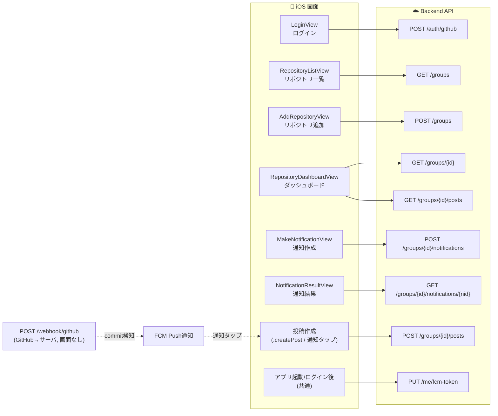

# API 一覧と画面↔API 対応

| 項目 | 内容 |
|---|---|
| バージョン | v1.0 |
| 最終更新日 | 2026-06-01 |
| 対象ブランチ | `feat/backend-api` |

実装済み API は `backend/cmd/server/main.go` のルーティング登録を真実のソースとする。

## 実装済み API 一覧

| Method | Path | 用途 | 認証 |
|---|---|---|---|
| POST | `/auth/github` | GitHub コード交換・ログイン | なし |
| POST | `/webhook/github` | GitHub Webhook 受信（サーバ間） | 署名検証 |
| GET | `/groups` | 参加グループ（リポジトリ）一覧 | Bearer |
| POST | `/groups` | グループ作成（リポジトリ登録 + Webhook 登録） | Bearer |
| GET | `/groups/{id}` | グループ詳細 + メンバー | Bearer + メンバー |
| POST | `/groups/{id}/notifications` | BeGit Time 通知発行 | Bearer + メンバー |
| GET | `/groups/{id}/notifications/{nid}` | 通知の達成ステータス（OnTime/Late/Missed） | Bearer + メンバー |
| POST | `/groups/{id}/posts` | 投稿作成 | Bearer + メンバー |
| GET | `/groups/{id}/posts` | フィード取得 | Bearer + メンバー |
| PUT | `/me/fcm-token` | FCM トークン登録 / 更新 | Bearer |

## 画面 ↔ API 対応図

## 補足

- **用語**: iOS の「Repository」= バックエンドの「Group」（グループはリポジトリに 1:1 で紐づく）。
- **実装状況**: 現在 iOS で実 API に接続しているのは `AuthAPI.exchangeCode` → `POST /auth/github` のみ。他の ViewModel（`RepositoryListViewModel` 等）は `Repository.mockRepositories` などのモックデータで動作しており、上図の対応は設計上の想定マッピング。
- **`/webhook/github`** は GitHub からサーバへのイベント受信用で、画面からは呼び出さない（commit 検知 → FCM Push → 投稿作成画面へ遷移、という流れ）。
- `docs/spec.md` には `/posts/:id/reactions`・`/groups/:id/sync-members`・`/github/repos` など未実装の構想エンドポイントも記載があるが、本書は `main.go` に登録済みのもののみを対象とする。
