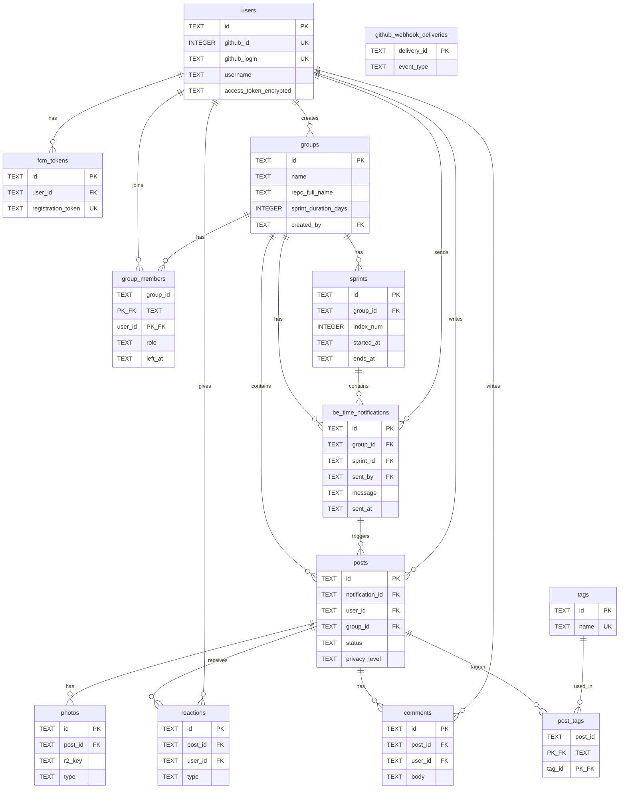
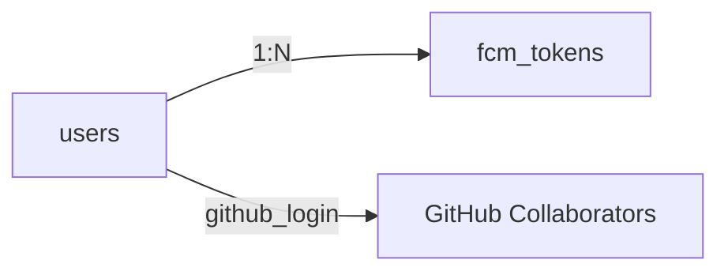
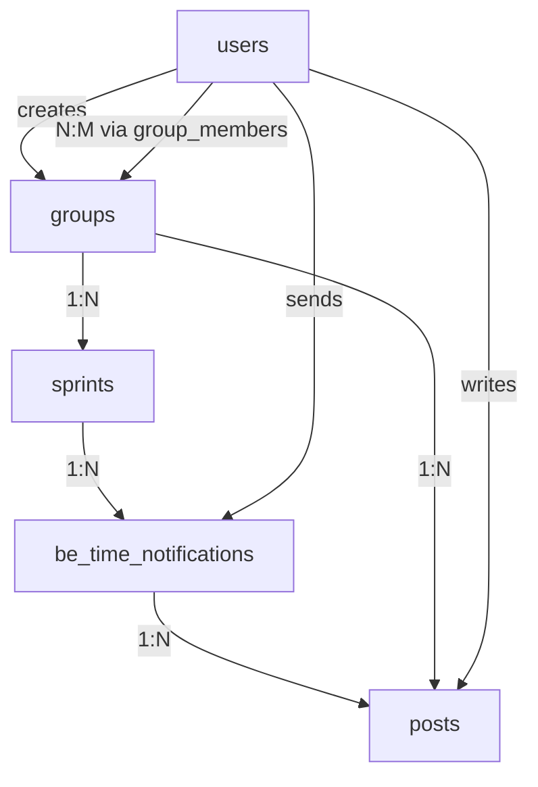
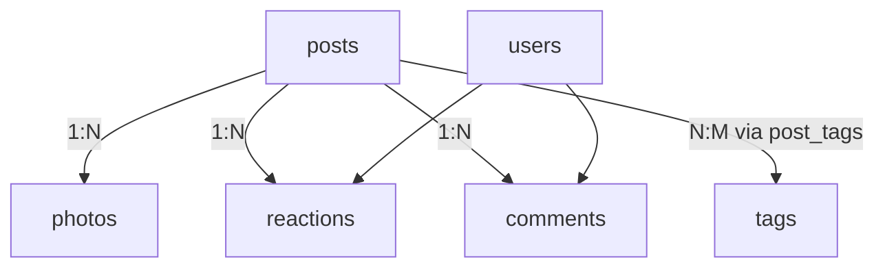
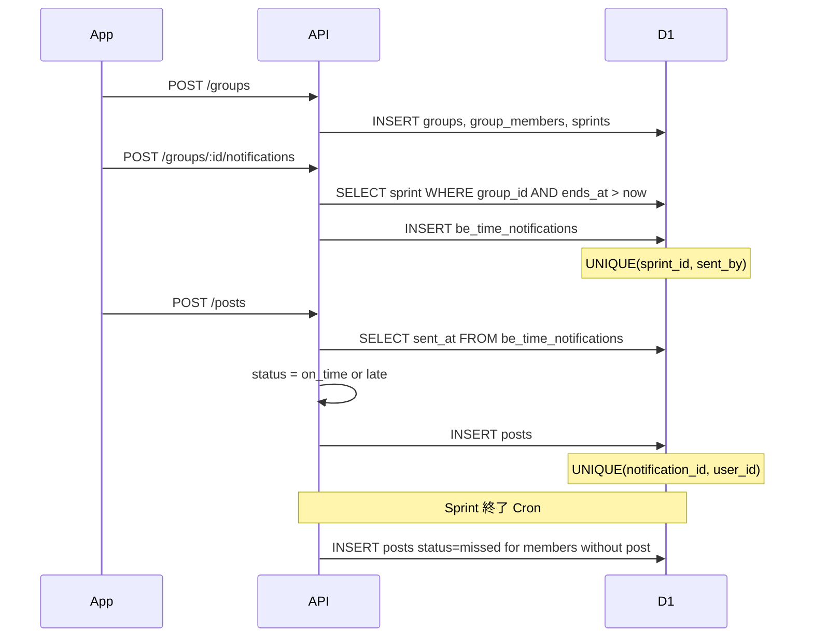

# BeGit データベース ER 図

**バージョン:** 1.0.0  
**DB:** Cloudflare D1（SQLite 互換）  
**スキーマ:** [backend/migrations/0001_initial.sql](../backend/migrations/0001_initial.sql)  
**関連:** [spec.md セクション6](../spec.md#6-データモデル) / [.kiro/steering/database.md](../.kiro/steering/database.md)

## 閲覧方法

| 方法 | ファイル | 手順 |
|------|---------|------|
| **ブラウザ（推奨）** | [database-er.html](database-er.html) | ファイルをダブルクリック、または `open docs/database-er.html` |
| **Mermaid ソース** | [database-er.mermaid](database-er.mermaid) | Cursor / VS Code の Mermaid プレビュー、または [Mermaid Live Editor](https://mermaid.live) に貼り付け |
| **GitHub** | この Markdown | GitHub 上では Mermaid が自動レンダリングされる |

---

## 全体 ER 図



> `github_webhook_deliveries` は他テーブルと FK を持たない独立テーブル（Webhook 冪等性用）。

---

## ドメイン別構造

### 認証・デバイス



- `users.github_login` で GitHub コラボレーター自動参加をマッチング
- `users.access_token_encrypted` はサーバー側で暗号化保存

### グループ・スプリント（中核）



- MVP では **Group : GitHub Repo = 1:1**（`groups.repo_full_name` に直接保持）
- `group_repositories` 中間テーブルは使用しない

### 投稿・ソーシャル



---

## データの流れ（時系列）



| 段階 | テーブル | 内容 |
|------|---------|------|
| 1 | `groups`, `group_members`, `sprints` | グループ作成 + 初回スプリント開始 |
| 2 | `be_time_notifications` | メンバーが BeGit Time 通知を発行 |
| 3 | `posts` | 各メンバーが開発状況を投稿 |
| 4 | `posts` (batch) | 未投稿者に `missed` を upsert |

---

## ビジネス制約

| 制約 | テーブル | 意味 |
|------|---------|------|
| `UNIQUE(sprint_id, sent_by)` | `be_time_notifications` | 1 スプリント・1 人・1 回だけ通知発行 |
| `UNIQUE(notification_id, user_id)` | `posts` | 1 通知に対し 1 ユーザー 1 投稿 |
| `UNIQUE(post_id, user_id, type)` | `reactions` | リアクション種別ごとに 1 つ |
| `PK(group_id, user_id)` | `group_members` | グループ所属の一意性 |
| `left_at IS NULL` | `group_members` | 在籍中メンバーの判定 |

### Post.status 算出

| status | 条件 |
|--------|------|
| `on_time` | `created_at` ≤ `sent_at` + 1 時間 |
| `late` | `created_at` > `sent_at` + 1 時間 |
| `missed` | 投稿なし — スプリント終了バッチで upsert |

---

## テーブル一覧（13 テーブル）

| # | テーブル | 役割 |
|---|---------|------|
| 1 | `users` | GitHub 連携ユーザー |
| 2 | `fcm_tokens` | Push 通知デバイストークン |
| 3 | `groups` | チーム（1 repo 紐付け） |
| 4 | `group_members` | グループ所属（User ↔ Group N:M） |
| 5 | `sprints` | スプリント期間 |
| 6 | `be_time_notifications` | BeGit Time 通知発行（FCM Push とは別概念） |
| 7 | `posts` | 開発状況投稿 |
| 8 | `tags` | 技術タグマスタ |
| 9 | `post_tags` | 投稿 ↔ タグ（N:M 中間） |
| 10 | `photos` | 添付写真（R2 オブジェクトキー） |
| 11 | `reactions` | リアクション |
| 12 | `comments` | コメント |
| 13 | `github_webhook_deliveries` | Webhook 冪等性 |

---

## リレーションシップ一覧

```
User 1──N FCMToken
User 1──N Group (created_by)
User N──N Group (via group_members)
Group 1──N Sprint
Sprint 1──N BeTimeNotification
BeTimeNotification 1──N Post
User 1──N Post
Group 1──N Post
Post 1──N Photo / Reaction / Comment
Post N──N Tag (via post_tags)
```

---

## 将来拡張（MVP 外）

| 機能 | 追加予定 |
|------|---------|
| フォロワー限定公開 | `follows` テーブル + `privacy_level = followers` |
| 複数リポジトリ紐付け | `group_repositories` 中間テーブル |
