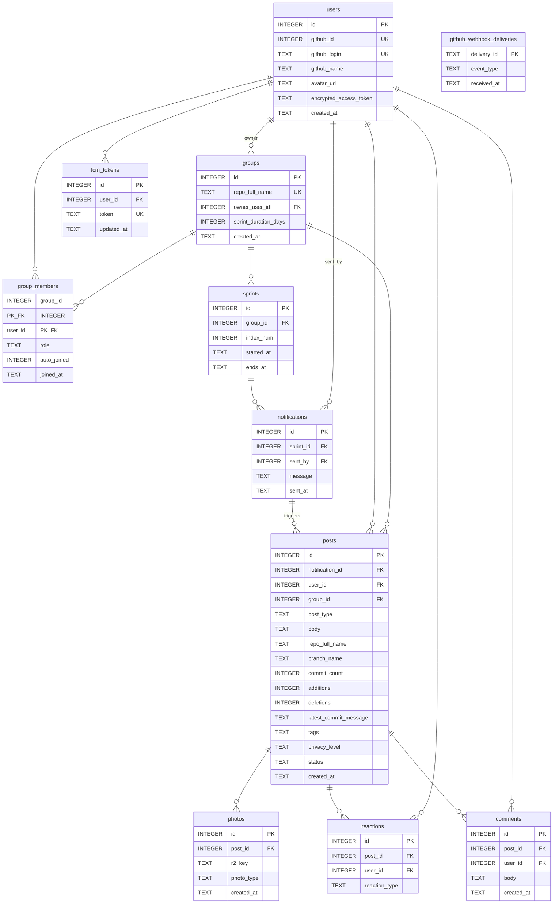

# BeGit; データベース ER 図

**DB:** Cloudflare D1（SQLite 互換）  
**スキーマ:** [`backend/migrations/0001_initial.sql`](../backend/migrations/0001_initial.sql)

---

## 全体 ER 図



---

## iOS モデルとの対応

| DB テーブル | iOS モデル | 主な対応フィールド |
|------------|-----------|-----------------|
| `users` | `GitHubUser` / `RepositoryMember` | `github_login` ↔ `.login`, `avatar_url` ↔ `.avatarURL` |
| `groups` | `Repository` | `repo_full_name` ↔ `.name` |
| `group_members` | `Repository.members` | JOIN して `[RepositoryMember]` を構築 |
| `sprints` | なし（サーバー内部） | グループ作成時に自動生成 |
| `notifications` | `RepositoryNotification` | `message` ↔ `.comment`, `sent_at` ↔ `.createdAt` |
| `posts` | `RepositoryActivity` (Dashboard) / 将来の `FeedPost` (Feed) | `post_type` ↔ `.type`, `body` ↔ `.comment` |
| `reactions` | `RepositoryReaction` / `FeedPost.reactions` | `reaction_type` で絵文字セットを区別 |
| `comments` | 将来の `FeedPost.comments` | |
| `photos` | 将来の `FeedPost.photos` | `r2_key` → Workers 経由で公開 URL 発行 |
| `github_webhook_deliveries` | なし（サーバー内部） | 他テーブルと FK なし。Webhook 冪等性のみ |

---

## `posts.post_type` 一覧

| 値 | 意味 | iOS SF Symbol | 絵文字セット |
|----|------|--------------|------------|
| `commit` | コミット報告 | `chevron.left.forwardslash.chevron.right` | heart / lgtm / grass |
| `pull_request` | PR オープン / レビュー | `arrow.triangle.pull` | lgtm / review / merge |
| `issue` | Issue 対応 | `exclamationmark.circle` | lgtm / watching |
| `review` | コードレビュー完了 | `eye` | lgtm / review |
| `comment` | 進捗メッセージ（今は作業できないが近況を共有） | `text.bubble` | heart / check |

---

## 主要ビジネス制約

| 制約 | テーブル | 意味 |
|------|---------|------|
| `UNIQUE(group_id, index_num)` | `sprints` | グループ内でスプリント番号は一意 |
| `UNIQUE(sprint_id, sent_by)` | `notifications` | 1スプリント1人1回の通知発行 |
| `UNIQUE(notification_id, user_id)` | `posts` | 1通知につき1ユーザー1投稿 |
| `UNIQUE(post_id, user_id, reaction_type)` | `reactions` | 同じリアクションは1回のみ |
| `PRIMARY KEY(group_id, user_id)` | `group_members` | グループ所属の一意性 |

---

## スプリントのライフサイクル

```
グループ作成
  → sprints INSERT (index_num=0, started_at=now, ends_at=now+sprint_duration_days)

スプリント期間中
  → notifications UNIQUE(sprint_id, sent_by) で1人1回制約
  → posts が notification_id を参照して on_time / late を判定

スプリント終了 (Cron)
  → 未投稿メンバーに posts INSERT (status='missed')
  → 次スプリント sprints INSERT (index_num+1)
```

## `posts.status` 算出ロジック

```
notification_id IS NULL             → NULL（通知と無関係の自発投稿）
created_at <= sent_at + 1時間       → 'on_time'
created_at >  sent_at + 1時間       → 'late'
スプリント終了後も posts レコードなし → Cron が 'missed' を INSERT
```

---

## Blur 制御ロジック（サーバー側）

`GET /groups/:id/posts` で、**リクエストユーザーが通知後に未投稿の場合**:

- `body`, `repo_full_name`, `branch_name`, `latest_commit_message`, `photos` を `null` で返す
- `blurred: true` フラグを付与

投稿済み、または通知なし期間なら全フィールドを返す。
