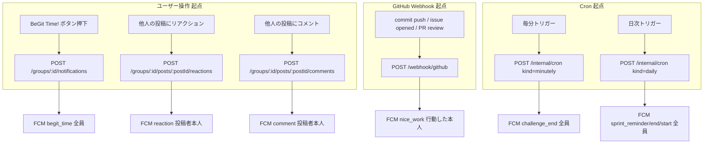
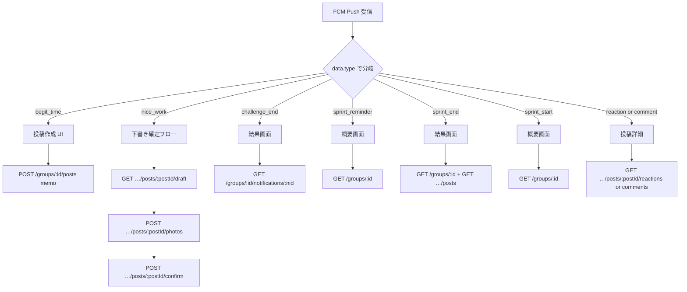
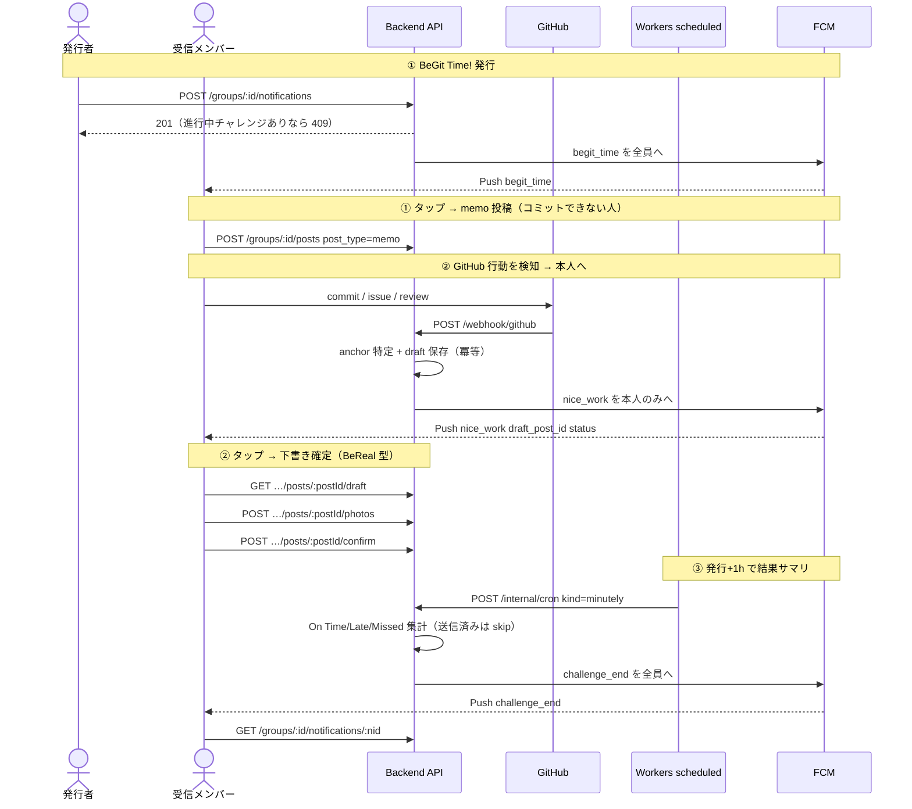
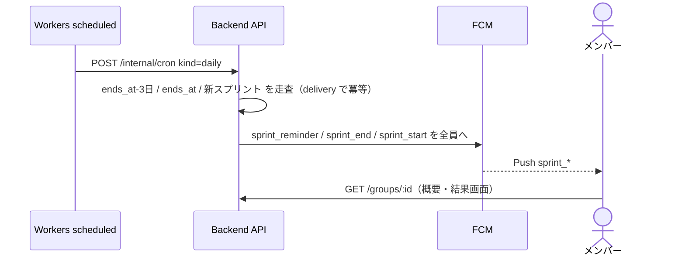

# BeGit; 通知 API と「叩く瞬間」マップ

**バージョン:** 0.1.0
**作成日:** 2026-06-02
**読者:** バックエンド / フロント（iOS）両方
**関連:** [design.md（マスター設計）](design.md) / [ios-guide.md（iOS 契約）](ios-guide.md) / [../api-screen-map.md（API↔画面）](../api-screen-map.md) / バックエンド SDD: [`begit-notifications`](../../.kiro/specs/begit-notifications)

---

## このドキュメントの役割

通知（7種）の **「どの瞬間に、誰が、どの API を叩くか」** を1枚に集約する。

通知まわりの API 呼び出しは大きく2つの瞬間に分かれる:

- **(A) 通知を“発火させる”瞬間** — ユーザー操作・GitHub イベント・時刻 Cron が起点。ここで FCM Push が飛ぶ。
- **(B) 通知を“受け取ってタップした後”の瞬間** — iOS が `type` を見て画面遷移し、所定の API を叩く。

加えて、**クライアントが叩かない**サーバ内部経路（Webhook 受信 / Cron）も区別して図示する。

> API のリクエスト/レスポンスの正確な形は OpenAPI（[`ios/BeGit/BeGit/openapi.yaml`](../../ios/BeGit/BeGit/openapi.yaml)）が正。本書は対応づけと発火タイミングに集中する。

---

## 0. 通知に関わる API 一覧（実装済み）

ルーティングの真実のソースは [`backend/cmd/server/container.go`](../../backend/cmd/server/container.go)。

| Method | Path | 用途 | 認証 | 起点 |
|---|---|---|---|---|
| PUT | `/me/fcm-token` | FCM トークン登録/更新 | Bearer | アプリ起動・トークン更新 |
| POST | `/groups/:id/notifications` | ① BeGit Time! 発行 | Bearer + メンバー | ユーザー操作 (A) |
| GET | `/groups/:id/notifications/:nid` | チャレンジ達成ステータス（On Time/Late/Missed） | Bearer + メンバー | ③通知タップ後 (B) |
| POST | `/groups/:id/posts` | 投稿作成（memo 含む） | Bearer + メンバー | ①通知タップ後 (B) |
| GET | `/groups/:id/posts` | フィード取得（draft 除外） | Bearer + メンバー | 画面表示 |
| GET | `/groups/:id/posts/:postId/draft` | ② 下書き取得（プレフィル元） | Bearer + メンバー | ②通知タップ後 (B) |
| POST | `/groups/:id/posts/:postId/confirm` | ② 下書き確定（draft 解除） | Bearer + メンバー | ②投稿確定時 (B) |
| POST | `/groups/:id/posts/:postId/photos` | 写真アップロード | Bearer + メンバー | ②投稿確定フロー (B) |
| POST | `/groups/:id/posts/:postId/reactions` | リアクション追加 | Bearer + メンバー | ⑦を発火 (A) |
| POST | `/groups/:id/posts/:postId/comments` | コメント投稿 | Bearer + メンバー | ⑦を発火 (A) |
| GET | `/groups/:id/posts/:postId/comments` | コメント一覧 | Bearer + メンバー | ⑦通知タップ後 (B) |
| GET | `/groups/:id/posts/:postId/reactions` | リアクション一覧 | Bearer + メンバー | ⑦通知タップ後 (B) |
| GET | `/groups/:id` | グループ詳細 + メンバー | Bearer + メンバー | ④⑤⑥通知タップ後 (B) |

### クライアントが叩かない内部経路（通知を発火させるが画面なし）

| Method | Path | 用途 | 認証 | 呼ぶ主体 |
|---|---|---|---|---|
| POST | `/webhook/github` | GitHub イベント受信 → ② Nice Work! 発火 | 署名検証（HMAC） | GitHub（サーバ間） |
| POST | `/internal/cron` | ③④⑤⑥ の時刻起点発火 | `X-Cron-Secret` | Workers `scheduled()`（内部） |

---

## 1. 中心の早見表：FCM `type` → タップ後に叩く API

iOS は受信通知の `data.type` で分岐する（[ios-guide.md §2](ios-guide.md)）。

| # | `type` | 受信者 | タップ後の遷移先画面 | そこで叩く API |
|---|---|---|---|---|
| ① | `begit_time` | グループ全員 | 投稿作成 UI（memo 可） | `POST /groups/:id/posts`（`post_type=memo`） |
| ② | `nice_work` | 本人だけ | 下書きプレフィル → 撮影 → 確定 | `GET …/posts/:postId/draft` → `POST …/photos` → `POST …/posts/:postId/confirm` |
| ③ | `challenge_end` | グループ全員 | チャレンジ結果画面 | `GET /groups/:id/notifications/:nid` |
| ④ | `sprint_reminder` | グループ全員 | スプリント概要画面 | `GET /groups/:id`（+ `GET …/posts`） |
| ⑤ | `sprint_end` | グループ全員 | スプリント結果画面 | `GET /groups/:id`（+ `GET …/posts`） |
| ⑥ | `sprint_start` | グループ全員 | スプリント概要画面 | `GET /groups/:id` |
| ⑦ | `reaction` / `comment` | 投稿者本人 | 該当投稿の詳細 | `GET …/posts/:postId/reactions` / `…/comments` |

> ④⑤⑥ には専用の「スプリント結果サマリ API」は未実装。iOS はグループ詳細 + フィードで概要を構成する（将来、専用サマリ API を追加する余地あり）。

---

## 2. 「叩く瞬間」の時系列分類

### (A) 通知を発火させる瞬間（Push が飛ぶ起点）



- **A1（①発行）** は同時にアクティブなチャレンジがあると **409**（時間的非共存）。
- **A2/A3（⑦）** は actor==投稿者なら発火しない（自己抑制）。
- **WH（②）** は「メンバーの初アクティビティ」のみ発火（冪等）。anchor は発行+1h を基準に on_time/late を確定。
- **CR1/CR2** はクライアントではなく Workers `scheduled()` が叩く内部経路。`notification_deliveries` で各通知1回に限定。

### (B) 通知を受け取ってタップした後の瞬間（iOS が API を叩く）



---

## 3. カテゴリ別シーケンス

### A. チャレンジ系（① → ② → ③）— BeGit Time サイクル全体



### B. スプリント系（④⑤⑥）— Cron 日次



### C. ソーシャル系（⑦）— 自己抑制

```mermaid
sequenceDiagram
    actor Actor as 反応した人
    actor Author as 投稿者
    participant API as Backend API
    participant FCM

    Actor->>API: POST …/posts/:postId/reactions（or comments）
    API->>API: actor == 投稿者 なら送信しない（自己抑制）
    API->>FCM: reaction / comment を投稿者本人へ
    FCM-->>Author: Push reaction or comment post_id actor_login
    Author->>API: GET …/posts/:postId/reactions（or comments）
```

---

## 4. 注意点（API を叩くときの落とし穴）

- **①の 409**: `POST /groups/:id/notifications` は進行中チャレンジ（発行+1h 以内）があると 409。UI で「別のチャレンジが進行中」をハンドリングする。
- **②は draft 前提**: `draft_post_id` の中身は `GET …/draft` で取得。**「写真が無い＝下書き」ではない**（draft は明示状態 `is_draft`）。確定は `POST …/confirm`。
- **フィードは draft 非表示**: `GET /groups/:id/posts` は `is_draft=0` のみ返す。確定するまでフィードに出ない。
- **数値も文字列**: FCM data は全フィールド文字列（`notification_id` 等は Int 変換が必要）。
- **内部経路は叩かない**: `/webhook/github`（GitHub→サーバ）と `/internal/cron`（Workers→コンテナ）は iOS からは絶対に叩かない。前者は署名検証、後者は `X-Cron-Secret` で保護。
- **トークン登録は先**: 通知を受けるには起動時/更新時に `PUT /me/fcm-token` が済んでいること。

---

## 5. まとめ（1行で）

- **発火（A）**: ①=`POST …/notifications` / ⑦=`POST …/reactions|comments` はクライアント操作、②=`/webhook/github`、③④⑤⑥=`/internal/cron` はサーバ内部。
- **受信後（B）**: iOS は `type` で分岐し、①→投稿作成 / ②→draft 取得→確定 / ③→ステータス取得 / ④⑤⑥→グループ詳細 / ⑦→投稿詳細、の API を叩く。
- **冪等の番人**: ② は `posts.UNIQUE(notification_id,user_id)`、③④⑤⑥ は `notification_deliveries(kind,ref_id)`。
